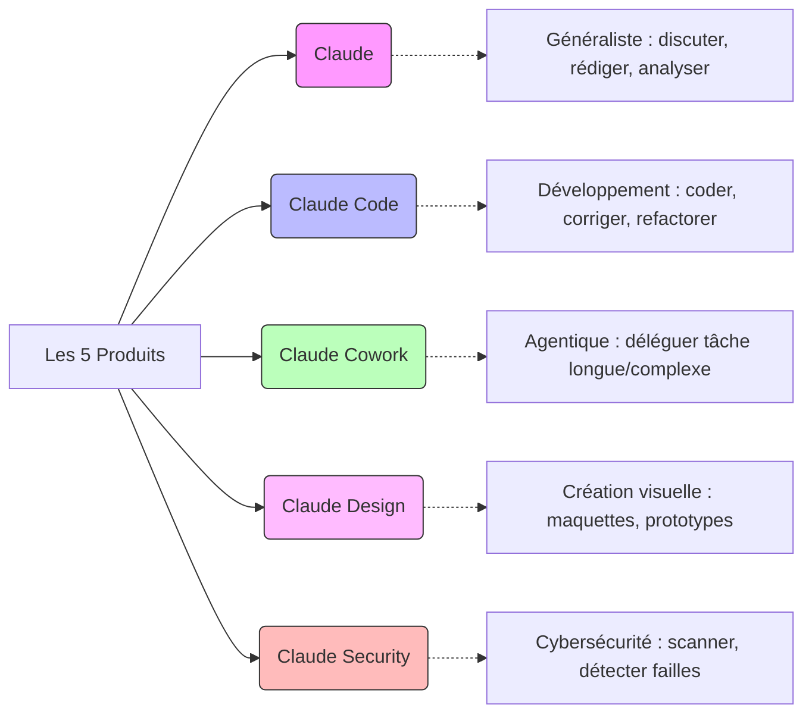
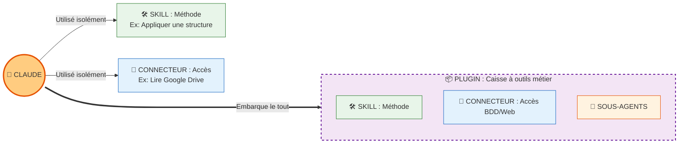
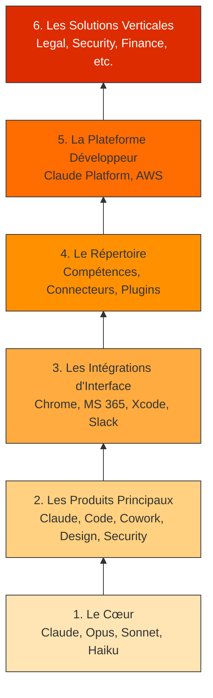

| Indices / questions clés | Notes détaillées |
|---|---|
| Différence produit / intégration / compétence / connecteur ? | **Produit** : Où je travaille (ex: Claude, Claude Code). **Intégration** : Dans quelle interface tierce j'utilise Claude (ex: Slack, Chrome). **Compétence (Skill)** : Quelle méthode spécialisée j'active. **Connecteur** : À quelles données/apps externes Claude est relié. |
| Quels sont les 5 produits principaux d'Anthropic ? | Claude (généraliste), Claude Code (dev), Claude Cowork (tâches longues/agentiques), Claude Design (visuels), Claude Security (cybersécurité). |
| Qu'est-ce qu'un Plugin ? | Un pack métier installable (regroupant skills, connecteurs, workflows). |
| À quoi sert Claude Platform ? | C'est la plateforme développeur (API, SDK) pour intégrer Claude dans ses propres systèmes. |
| Que signifient GA, Public beta et Research preview ? | **GA** : Stable/Disponibilité générale. **Public beta** : Évolutif. **Research preview** : Expérimental/Limité. |
| Pourquoi cette distinction compte ? (Risques & Gouvernance) | Utiliser le bon outil évite les risques (ex: limiter Claude for Chrome pour la sécu web). Permet une meilleure gouvernance (qui a accès à quoi, qui installe un plugin ou connecteur). |

## Synthèse
L'écosystème Anthropic se déploie sur plusieurs niveaux : des modèles (Opus, Sonnet, Haiku) qui motorisent cinq produits principaux (Claude, Code, Cowork, Design, Security). Ces produits peuvent s'intégrer dans des outils tiers (Chrome, MS 365, Slack) et être enrichis via un répertoire de Compétences (Skills), Connecteurs et Plugins métiers. Enfin, la Claude Platform et les solutions verticales permettent d'intégrer l'IA dans n'importe quel système en respectant gouvernance et sécurité.

## Glossaire
- **API** : Interface permettant à un logiciel d'utiliser les capacités d'un autre logiciel.
- **Connecteur** : Lien permettant à Claude d'accéder à des données ou applications externes (souvent via MCP).
- **IDE** : Environnement de développement intégré (ex: VS Code).
- **MCP (Model Context Protocol)** : Protocole standardisé pour connecter un modèle à des outils, données et services.
- **Plugin** : Pack installable regroupant plusieurs compétences et connecteurs pour un workflow ou métier précis.
- **Skill (Compétence)** : Méthode de travail spécialisée, préparée à l'avance et réutilisable.
- **Solutions verticales** : Offres adaptées à des secteurs spécifiques (Légal, Finance, Sécurité) avec des règles et connecteurs métiers.

## Questions d'auto-évaluation
1. Si je dois réaliser un livrable complexe en manipulant plusieurs fichiers locaux de manière autonome, quel produit Anthropic dois-je utiliser ?
2. Quelle est la différence fondamentale entre une *Skill* et un *Plugin* ?
3. Quel produit utiliseriez-vous pour détecter des failles dans une grande base de code d'entreprise ?
4. Pourquoi doit-on être particulièrement vigilant (gouvernance/permissions) avant d'activer un Connecteur ?

# Tour d’horizon des produits Anthropic

**Durée : 20 minutes**

## Notes

### Les 5 produits principaux d'Anthropic

### L'Écosystème d'intégration (Le Répertoire)

### La Pyramide à 6 Niveaux

## Points clés

- Anthropic propose un écosystème en couches : modèles de base (le moteur), produits principaux (surfaces), intégrations tierces, et un répertoire d'extensions.
- Il y a 5 produits distincts : **Claude**, **Claude Code**, **Claude Cowork**, **Claude Design**, et **Claude Security**.
- Le répertoire contient 3 grandes familles : **Skills** (méthodes), **Connecteurs** (données) et **Plugins** (workflows).
- La distinction est vitale pour la **gouvernance et la sécurité** : chaque intégration (API, MCP, Slack, Chrome) expose les données différemment et nécessite des droits spécifiques.
- **Règle d'or** (les 6 questions) : Où est-ce que je travaille ? Dans quelle interface externe ? Avec quel moteur ? Avec quelles compétences ? Avec quelles connexions ? Avec quelles permissions ?
