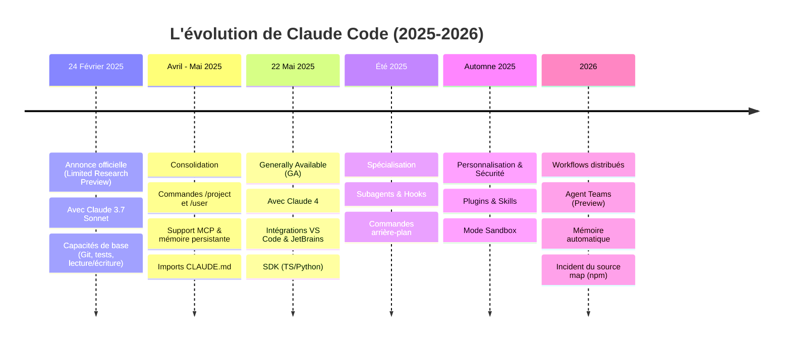
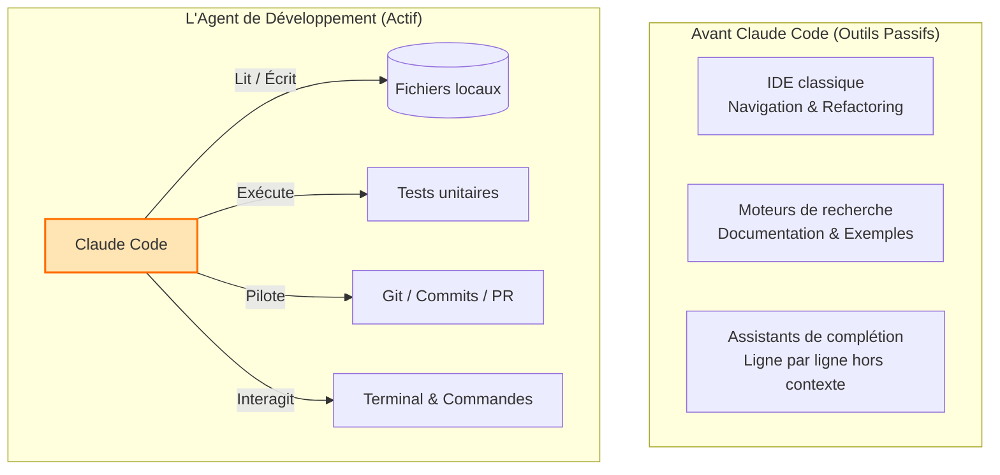

| Indices / questions clés | Notes détaillées |
|---|---|
| Comment fonctionnait l'aide au dev avant Claude Code ? | Reposait sur 3 piliers : les **IDE** (navigation, refactoring), les **moteurs de recherche** (doc, exemples), et les **assistants de complétion** (snippets locaux hors-contexte). Les assistants de chat n'agissaient pas directement sur l'environnement. |
| Qu'est-ce qui définit la rupture historique de Claude Code ? | Le passage de la conversation à **l'action** : c'est un agent autonome intégré au terminal capable d'explorer, de modifier, de compiler, d'exécuter des tests et de Git-commit par lui-même. |
| Qui sont les figures clés du projet ? | **Boris Cherny** (ingénierie et origine technique), **Cat Wu** (pilotage produit), **Sid Bidasaria** (founding engineer/tech lead) et **Cal Rueb** (démonstrations/bonnes pratiques). |
| Quelles sont les dates clés d'évolution ? | **24 fév 2025** : Annonce en *Limited Research Preview* (avec Claude 3.7 Sonnet). **22 mai 2025** : Passage en GA (avec Claude 4), intégration IDE, SDK, GitHub Actions. **Automne 2025** : Apparition des Plugins, Skills et du Mode Sandbox. |
| Qu'est-ce que l'incident du source map de 2026 ? | Publication par erreur d'un fichier source map du paquet npm `@anthropic-ai/claude-code` exposant le code TypeScript du client. Pas de fuite de données serveurs, mais sensibilisation aux risques de supply chain de l'IA. |

## Synthèse
Claude Code est né d'une expérimentation technique visant à intégrer Claude directement dans le terminal pour passer du simple chat à l'action autonome sur le code. Son histoire (de la preview en 2025 à la GA en 2026) est celle d'une transition rapide vers un écosystème multi-surfaces (IDE, SDK, CI/CD) et multi-agents (Agent Teams), validé par des cas d'usage réels comme Stripe (migrations massives) et Ramp (analyse d'incidents).

## Glossaire
- **Action agentique** : Capacité d'un outil d'IA à planifier des étapes, utiliser des outils locaux (compilateur, testeur) et corriger ses propres erreurs.
- **Limited Research Preview** : Phase de test publique limitée et expérimentale d'un produit.
- **Sandbox** : Environnement d'exécution sécurisé et isolé pour éviter que l'IA ne réalise des actions système destructrices sur la machine hôte.
- **Source map** : Fichier qui permet de faire le lien entre le code JavaScript minifié/compilé et le code source original (TypeScript ici), facilitant le débogage mais risquant de révéler le code propriétaire s'il est exposé.
- **Supply chain (sécurité)** : Chaîne d'approvisionnement logicielle ; risques liés aux dépendances tierces (comme les packages npm) installées sur une machine.

## Questions d'auto-évaluation
1. Pourquoi la philosophie de Claude Code est-elle qualifiée d'héritière de l'univers Unix ?
2. Quelle différence y a-t-il entre l'adoption de Claude Code chez Stripe et chez Ramp ?
3. Quels mécanismes ont été introduits à l'automne 2025 pour sécuriser l'exécution de commandes système par l'agent ?

# Histoire de Claude Code

**Durée : 14 minutes**

## Notes

### Évolution chronologique de Claude Code

### Le positionnement de Claude Code

## Points clés

- Claude Code comble le fossé des assistants classiques en passant d'une interface de chat à un agent actif dans le terminal.
- L'outil a été cofondé par des ingénieurs clés comme Boris Cherny (origine technique) et Sid Bidasaria (tech lead), puis cadré par Cat Wu pour le produit.
- En mai 2025 (GA avec Claude 4), Claude Code sort du terminal pour s'intégrer aux IDE, CI/CD et via un SDK en Python/TypeScript.
- Des cas d'usage chez Stripe (migrations à grande échelle) et Ramp (détection d'incidents) démontrent son adoption concrète.
- L'incident du source map de 2026 a rappelé l'importance de sécuriser l'installation des dépendances IA sur les postes de travail.
