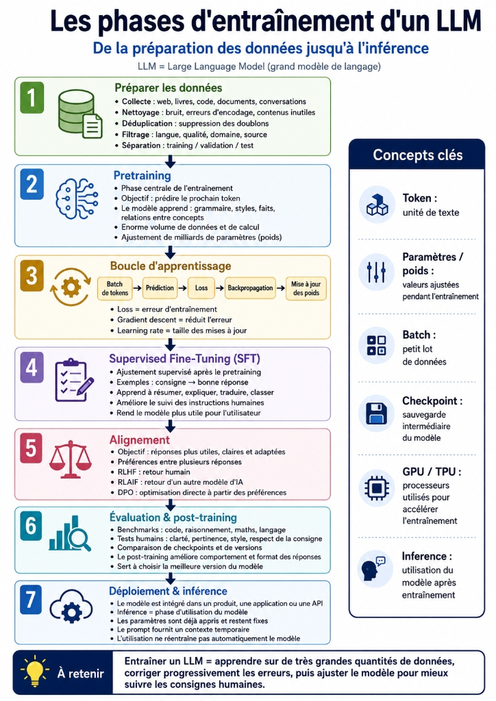

| Indices / questions clés | Notes détaillées |
|---|---|
| Comment un LLM apprend-il ? | Il n'apprend pas par cœur des règles. Il **ajuste des milliards de paramètres** (weights/poids) en s'entraînant sur d'immenses datasets de textes bruts pour réduire ses erreurs de prédiction. |
| Quelles sont les 3 étapes de traitement du dataset ? | 1. **Nettoyage** : Supprimer le bruit (balises, textes tronqués). 2. **Déduplication** : Retirer les textes identiques répétés pour ne pas fausser l'importance relative. 3. **Filtrage** : Sélectionner les données de qualité. |
| C'est quoi le Pretraining (Pré-entraînement) ? | Phase la plus lourde et coûteuse. Le modèle apprend la structure de la langue et les faits généraux en s'entraînant à **prédire le prochain token** à très grande échelle. |
| Qu'est-ce que le SFT (Ajustement Supervisé) ? | *Supervised Fine-Tuning* : On entraîne le modèle pré-entraîné avec des paires de **consignes / réponses idéales** pour lui apprendre à se comporter en assistant (obéir à des instructions). |
| Qu'est-ce que l'Alignement (RLHF/RLAIF/DPO) ? | Méthodes appliquées après le SFT pour orienter les réponses du LLM selon les **préférences humaines** (utilité, ton, sécurité). Le post-training regroupe le SFT et l'Alignement. |
| Comment marche la boucle d'apprentissage mathématique ? | 1. **Loss function** : Calcule l'écart (l'erreur) entre la prédiction et le vrai mot. 2. **Backpropagation** : Propage l'erreur en sens inverse pour identifier quels paramètres l'ont causée. 3. **Gradient descent** : Ajuste les paramètres pour réduire la loss (comme descendre une montagne dans le brouillard). |
| Quelle est la différence entre Entraînement et Inférence ? | **Entraînement** : Les paramètres (weights) sont modifiés en permanence à chaque batch. **Inférence (Utilisation)** : Le modèle est figé, ses paramètres ne changent plus. Le prompt est un contexte temporaire de travail. |

## Synthèse
L'entraînement d'un LLM s'effectue en plusieurs phases : la préparation des données (nettoyage/déduplication), le pretraining (apprentissage brut de complétion du mot suivant), le post-training (SFT pour apprendre à suivre des consignes et Alignement comme RLHF/DPO pour se conformer aux préférences humaines) et enfin l'évaluation. Une fois déployé en inférence, les paramètres du modèle restent fixes et les requêtes n'altèrent plus sa structure.

## Glossaire
- **Backpropagation (Rétropropagation)** : Calcul mathématique de l'erreur renvoyé en arrière dans le réseau de neurones pour identifier quels poids (weights) modifier.
- **Batch** : Groupe (lot) de données traité simultanément par le modèle à chaque étape de calcul.
- **Checkpoint** : Sauvegarde intermédiaire de l'état des paramètres d'un modèle en cours d'entraînement.
- **DPO (Direct Preference Optimization)** : Méthode d'alignement direct sur les paires de préférences sans nécessiter de modèle de récompense intermédiaire.
- **Gradient descent (Descente de gradient)** : Algorithme d'optimisation ajustant les paramètres dans la direction qui minimise l'erreur.
- **Loss function (Fonction de perte)** : Fonction calculant mathématiquement l'écart entre la prédiction de l'IA et la réalité.
- **RLHF (Reinforcement Learning from Human Feedback)** : Apprentissage par renforcement basé sur les préférences humaines pour aligner le modèle.
- **SFT (Supervised Fine-Tuning)** : Entraînement supervisé sur des instructions pour transformer un prédicteur de mots en assistant.

## Questions d'auto-évaluation
1. Si un LLM n'est entraîné que par pretraining (sans SFT), comment va-t-il réagir à la commande *"Traduis ce texte"* ?
2. Pourquoi la déduplication est-elle une étape indispensable de la préparation des données ?
3. Quelle est la différence entre un GPU et un TPU dans le cadre de l'entraînement ?

# Les phases d’entraînement d’un LLM

**Durée : 19 minutes**

## Notes

Voici l'infographie récapitulative des grandes étapes de l'entraînement d'un LLM :

## Points clés

- L'entraînement modifie les **paramètres (weights)**, tandis que l'inférence les utilise de manière **fixe**.
- Le **pretraining** donne le socle de langage (loss function + backpropagation + gradient descent sur des batches).
- Le **post-training (SFT + Alignement)** façonne les réponses (consignes et préférences RLHF/RLAIF/DPO).
- L'entraînement à grande échelle requiert du matériel spécifique (**GPU/TPU**) et des techniques de **parallélisme**.
