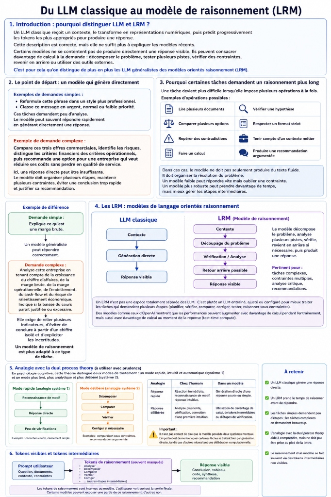
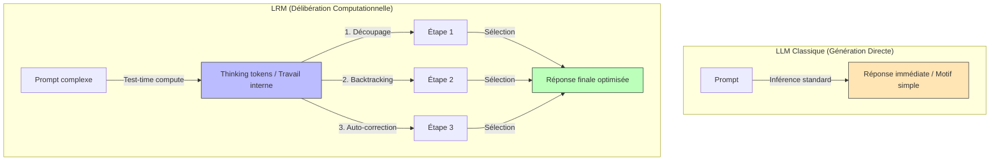

| Indices / questions clés | Notes détaillées |
|---|---|
| Qu'est-ce qu'un LRM ? | *Large Reasoning Model* : LLM optimisé (via RL) pour résoudre des tâches complexes par étapes de délibération computationnelle. |
| Qu'est-ce que le test-time compute ? | Calcul utilisé **au moment de la réponse** (inférence). Permet d'allouer plus de temps de réflexion aux tâches difficiles. |
| Comment contrôler le raisonnement ? | 1. **Thinking budget** : Nombre max de tokens alloués à la réflexion. 2. **Reasoning effort** : Niveau d'effort demandé (Low, Medium, High) influençant le temps et le coût. |
| Que fait le modèle avec plus de réflexion ? | **Découpage** du problème, **vérification** des contrentes, **backtracking** (retour en arrière après erreur), et **recherche d'infos** via outils. |
| Quelle différence entre ORM et PRM ? | **ORM** (*Outcome*) : Récompense uniquement le résultat final (récompense sparse/pauvre). **PRM** (*Process*) : Récompense chaque étape intermédiaire (plus riche et plus adapté au raisonnement). |
| Qu'est-ce que la distillation de raisonnement ? | Entraîner un modèle étudiant léger (*student*) sur les traces de raisonnement d'un modèle enseignant puissant (*teacher*) pour réduire les coûts. |

## Synthèse
Les modèles de raisonnement (LRM) se distinguent des LLM classiques par l'allocation de calcul à l'inférence (*test-time compute*), générant des tokens de réflexion (*thinking tokens*) invisibles pour structurer la résolution (découpage, backtracking, auto-correction). Entraînés par renforcement via des modèles de récompense de processus (PRM), leurs capacités peuvent être distillées dans des modèles plus petits pour des tâches ciblées, bien que ces derniers restent moins fiables sur les cas rares.

## Glossaire
- **Backtracking (Retour en arrière)** : Capacité de l'agent à abandonner une piste logique erronée pour recommencer sur une autre voie.
- **Distillation** : Transfert de connaissances d'un grand modèle (*teacher*) vers un modèle plus petit (*student*).
- **ORM (Outcome Reward Model)** : Évaluation et récompense de l'exactitude de la réponse finale uniquement.
- **PRM (Process Reward Model)** : Évaluation et récompense de la validité de chaque étape intermédiaire de raisonnement.
- **Reasoning effort** : Paramètre qualitatif (Low/Medium/High) définissant l'intensité du raisonnement.
- **Test-time compute** : Temps et ressources de calcul alloués au modèle lors de l'inférence pour formuler sa réponse.
- **Thinking budget** : Quantité maximale de tokens de raisonnement autorisée pour une réponse.

## Questions d'auto-évaluation
1. Pourquoi la distillation ne remplace-t-elle pas complètement l'usage d'un grand modèle ?
2. Quelle est la principale limite d'un Outcome Reward Model (ORM) sur une tâche de logique complexe ?
3. En quoi consiste l'analogie de la *Dual Process Theory* appliquée aux LLM ?

# Les LRM et l'effort

**Durée : 20 minutes**

## Notes

Voici l'infographie récapitulant les différences fonctionnelles et d'entraînement entre un LLM classique et un modèle de raisonnement (LRM) :

### Du LLM classique au modèle de raisonnement

## Points clés

- Un LRM utilise du **test-time compute** pour réfléchir avant de répondre.
- Les **thinking tokens** permettent de décomposer les problèmes et de s'auto-corriger.
- On contrôle ce calcul via le **thinking budget** ou le **reasoning effort**.
- L'entraînement repose sur des récompenses de processus (**PRM**) plutôt que de résultat (**ORM**).
- La **distillation** de raisonnement permet d'équiper de petits modèles à moindre coût pour des tâches répétitives.
