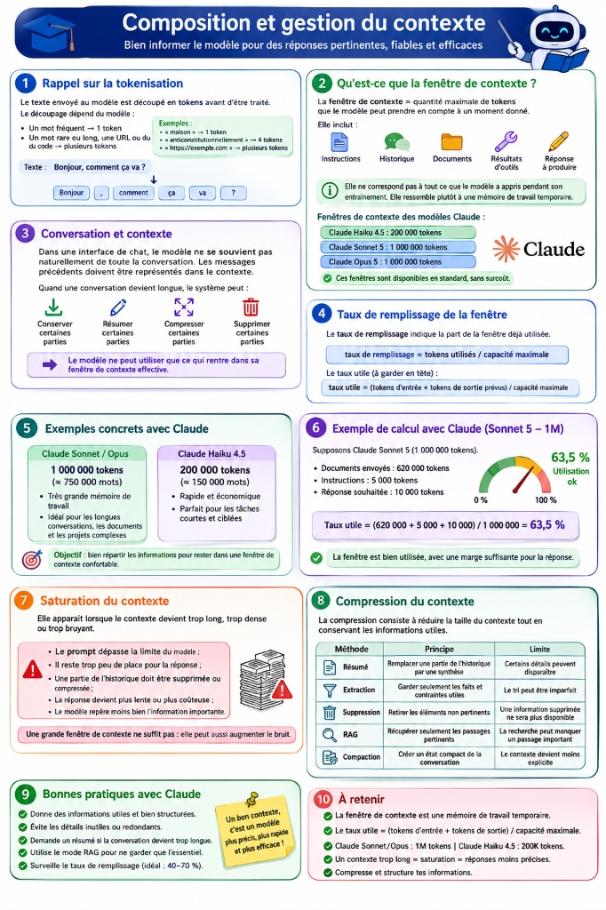
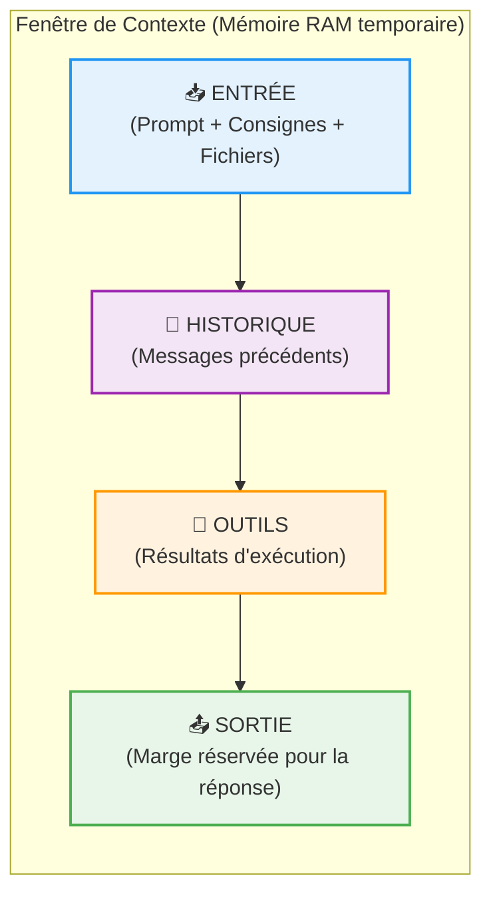
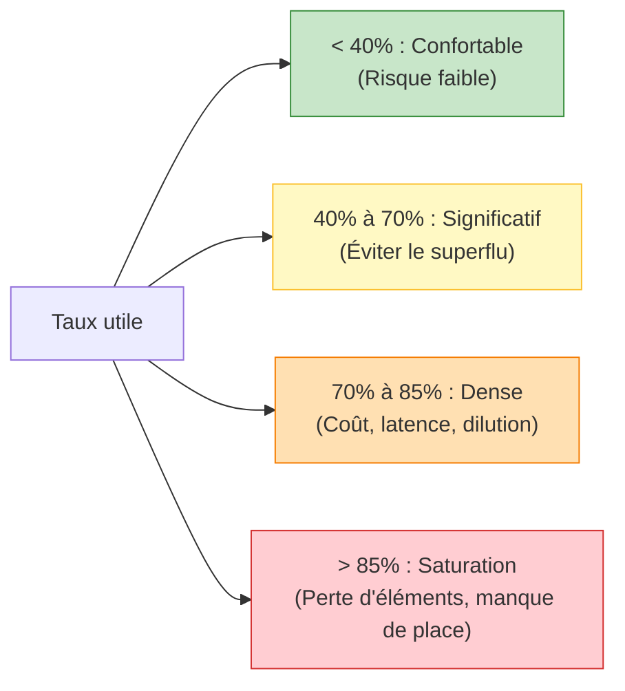

| Indices / questions clés | Notes détaillées |
|---|---|
| Qu'est-ce que la fenêtre de contexte ? | Quantité maximale de tokens (entrée et sortie) qu'un modèle traite à un moment donné. Fonctionne comme une **mémoire de travail temporaire** (RAM). |
| Qu'inclut la fenêtre de contexte ? | Les instructions du prompt, l'historique de la session, les documents fournis, les retours d'outils et la réponse en cours de génération. |
| Qu'est-ce que le taux utile ? | Ratio mesurant l'occupation réelle de la fenêtre en cumulant l'entrée et la marge de sortie prévue : $\frac{\text{Entrée} + \text{Sortie prévue}}{\text{Capacité}}$. |
| Quels sont les risques de saturation (>85%) ? | Lenteur, hausse des coûts, **dilution de l'attention** (le modèle trouve moins bien l'information importante) ou erreur de limite dépassée. |
| Comment compresser le contexte ? | - **Résumé** (synthèse d'historique). - **Extraction** (garder uniquement les contraintes). - **Suppression** (tronquer l'ancien). - **RAG** (chercher les passages clés). |
| Pourquoi une grande fenêtre ne suffit pas ? | Elle augmente la capacité de stockage mais ne garantit pas la **récupération** (retrouver l'info dans la masse) ni le **raisonnement** logique. |

## Synthèse
La fenêtre de contexte agit comme la mémoire RAM d'un LLM. Pour éviter sa saturation (qui provoque dilution de l'attention, lenteur et surcoût), il est crucial de surveiller le taux de remplissage utile (incluant la marge pour la réponse) et d'appliquer des techniques de compression (RAG, résumés d'historique, extraction de contraintes). Placer la consigne de travail après les documents longs reste une règle d'or pour focaliser l'attention du modèle.

## Glossaire
- **Compaction** : Stratégie visant à synthétiser et condenser l'historique d'une conversation sous forme de variables ou d'états d'avancement pour économiser les tokens.
- **Fenêtre de contexte** : Limite physique du modèle mesurée en tokens, encadrant tout ce qu'il peut "lire" et "écrire" lors d'une seule exécution.
- **RAG (Retrieval-Augmented Generation)** : Technique consistant à n'injecter dans le prompt que les segments de documents sémantiquement proches de la question de l'utilisateur.
- **Saturation** : État où la fenêtre de contexte est trop encombrée de données ou de bruit, nuisant aux performances de l'attention et de la génération.
- **Taux utile** : Indicateur de remplissage prenant en compte les données d'entrée plus le volume estimé de la réponse finale.
- **Tokenisation** : Processus de découpage du texte brut en jetons (tokens) numériques compréhensibles par le réseau de neurones.

## Questions d'auto-évaluation
1. Pourquoi est-il risqué de pousser le taux de remplissage utile d'un contexte au-delà de 85 % ?
2. Quelle est la différence entre la capacité de stockage d'un contexte et la capacité de récupération (retrieval) du modèle ?
3. Pourquoi conseille-t-on de placer la consigne de travail à la toute fin d'un prompt contenant de longs documents ?

# Composition et gestion du contexte

**Durée : 13 minutes**

## Notes

Voici l'infographie récapitulative pour bien informer le modèle et optimiser la gestion de son contexte :

### Composition de la fenêtre de contexte

### Évaluation de la densité du contexte (Taux utile)

## Points clés

- La fenêtre de contexte n'est pas une bibliothèque à long terme, c'est une **mémoire de travail temporaire**.
- Chaque message dans un chat renvoie **tout l'historique** dans le modèle, consommant rapidement la fenêtre.
- Le **taux utile** doit toujours inclure la marge réservée pour la réponse finale ($\text{Entrée} + \text{Sortie} \le \text{Capacité}$).
- Une grande fenêtre augmente le **bruit** ; il faut compresser (résumé, RAG, extraction) pour maintenir la précision de l'**attention**.
- **Bonne pratique** : Placer la consigne de travail **après** les documents longs.
