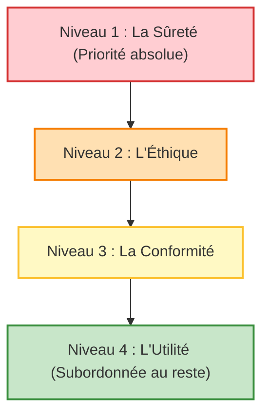
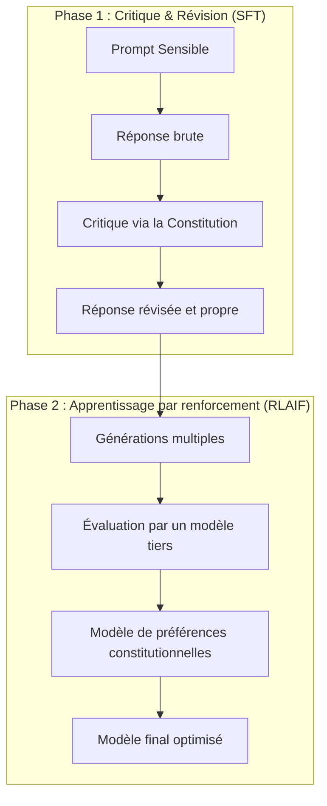

| Indices / questions clés | Notes détaillées |
|---|---|
| Qu'est-ce que Constitutional AI ? | Méthode d'alignement entraînant le modèle à évaluer et corriger ses propres réponses à partir de principes écrits (la constitution). |
| Quelles sont les limites du RLHF ? | Exposition des annotateurs à la violence, **sycophantie** (flatterie), valeurs culturelles cachées et complexité à passer à l'échelle (*scalability*). |
| Comment s'articulent les deux phases ? | 1. **Critique et Révision** (SFT) : Le modèle s'auto-corrige par rapport à un principe. 2. **Apprentissage par Renforcement** (RLAIF) : Un modèle tiers évalue les réponses selon la constitution. |
| Quelle est la hiérarchie à 4 niveaux (2026) ? | **Niveau 1** : Sûreté (risques critiques, armes, cyberarmes). **Niveau 2** : Éthique (honnêteté, non-manipulation). **Niveau 3** : Conformité (consignes de l'opérateur). **Niveau 4** : Utilité (aide à l'utilisateur). |
| Qui sont les "principals" (acteurs) ? | Les acteurs légitimes dont Claude doit arbitrer les intérêts : l'opérateur (API), l'utilisateur final et Anthropic (sécurité générale). |
| Hard constraints vs comportements ajustables ? | **Hard constraints** : Limites absolues non négociables (ex: CSAM, armes). **Comportements instructibles** : Comportements par défaut modifiables (ton, langue). |

## Synthèse
Constitutional AI est la signature d'Anthropic pour aligner Claude en remplaçant l'évaluation humaine directe par des retours d'IA (RLAIF) basés sur une constitution écrite. Restructurée en 2026 autour d'une hiérarchie à quatre niveaux (sûreté, éthique, conformité, utilité), cette approche cherche à limiter la sycophantie et à rendre les valeurs explicites, tout en distinguant des contraintes physiques absolues (les hard constraints) de règles métier ajustables.

## Glossaire
- **Amélioration de Pareto** : Concept indiquant qu'un modèle devient plus sûr sans pour autant dégrader sa capacité à se rendre utile.
- **Constitutional AI** : Approche d'alignement basée sur le respect de principes écrits fondamentaux, visant à réduire le besoin d'intervention humaine dans la modération.
- **CSAM (Child Sexual Abuse Material)** : Contenus d'abus sexuels sur mineurs, représentant une contrainte d'interdiction absolue dans le modèle.
- **Jailbreak** : Technique de manipulation de prompts cherchant à forcer le modèle à ignorer ses règles éthiques ou constitutionnelles.
- **RLAIF (Reinforcement Learning from AI Feedback)** : Apprentissage par renforcement où le signal de préférence est donné par un modèle d'IA évaluant la constitution.
- **Sycophantie** : Propension du modèle d'IA à flatter l'utilisateur en allant dans son sens, même si ses affirmations sont fausses ou dangereuses.

## Questions d'auto-évaluation
1. Pourquoi le RLHF favorise-t-il parfois la *sycophantie* chez les LLM, et comment Constitutional AI corrige-t-elle cela ?
2. Quelle est la différence majeure entre le Niveau 1 (Sûreté) et le Niveau 4 (Utilité) dans la hiérarchie de la constitution de 2026 ?
3. Comment Claude traite-t-il les documents externes fournis par l'utilisateur pour éviter les injections de prompts ?

# La spécificité Anthropic : la Constitution IA

**Durée : 23 minutes**

## Notes

### La hiérarchie à 4 niveaux de la constitution (2026)

### Le pipeline Constitutional AI

## Points clés

- La constitution de Claude est un texte de principes de référence, mis à jour en **janvier 2026** (licence CC0).
- Contrairement au RLHF, Constitutional AI s'appuie sur le **RLAIF** (le modèle évalue ses propres sorties à l'aide de la constitution).
- La constitution classe les devoirs de Claude en **4 niveaux** (Sûreté > Éthique > Conformité > Utilité).
- Les **hard constraints** (armes de destruction massive, CSAM, cyberarmes) sont absolues et non négociables pour l'utilisateur et l'opérateur.
- Face à un refus négocié sur un sujet sensible, l'utilisateur a intérêt à **fournir un contexte légitime d'usage** au lieu de tenter un jailbreak.
