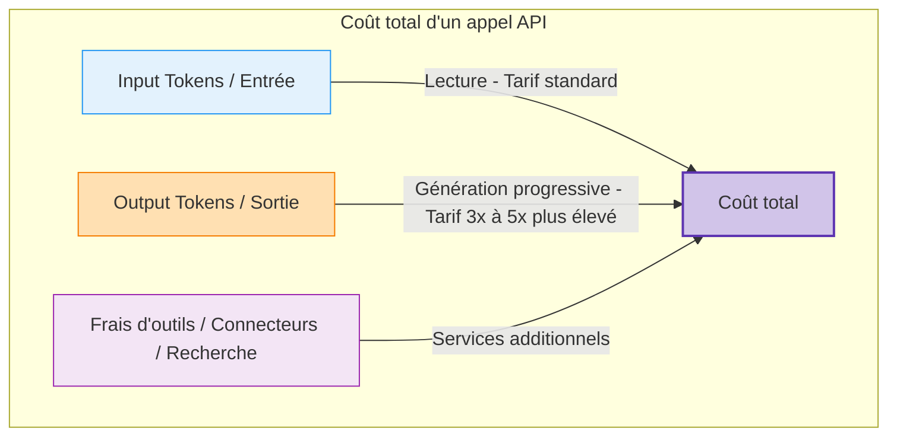
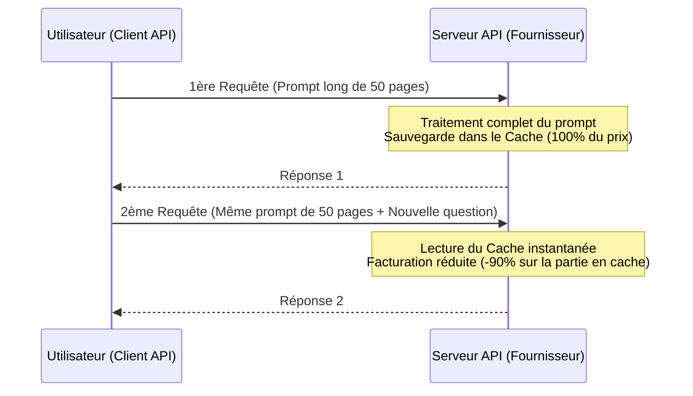

| Indices / questions clés | Notes détaillées |
|---|---|
| Comment est mesurée la consommation via API ? | Elle est mesurée en **tokens** (jetons) traitées. On paie séparément les tokens en entrée et les tokens en sortie par million de tokens. |
| Pourquoi les output tokens sont-ils plus chers ? | Ils coûtent **3 à 5 fois plus cher** que les input tokens. Le modèle calcule et génère les réponses de manière auto-régressive, token par token. |
| Qu'incluent les input tokens ? | Tout le contexte envoyé : prompt, instructions système, historique complet du chat, fichiers joints et données issues de connecteurs. |
| Quels sont les coûts cachés des agents ? | Les agents fonctionnent en boucle fermée (rédaction, outils, correction) ; une seule consigne utilisateur peut générer 10+ requêtes internes. |
| Qu'est-ce que le Prompt Caching ? | Mise en cache d'un contexte stable (ex: doc technique, règles métier). Réduit le coût de lecture de l'entrée **jusqu'à 90 %** sur les appels suivants. |
| Qu'est-ce que le Batch Processing ? | Envoi de requêtes massives non urgentes traitées sous 24h par le fournisseur en heures creuses, avec une **remise de 50 %** sur le tarif standard. |

## Synthèse
L'économie des LLM via API est régie par la consommation de tokens, où les jetons de sortie (output) sont nettement plus chers que ceux d'entrée (input) en raison de la nature progressive de la génération. Les projets d'entreprise doivent arbitrer le choix du modèle selon la complexité et optimiser le budget en exploitant le prompt caching pour les contextes récurrents stables et le batch processing pour les traitements de masse asynchrones.

## Glossaire
- **Batch Processing (Traitement en lots)** : Envoi groupé de tâches non immédiates traitées sous 24 heures à tarif réduit (-50 %).
- **Input Tokens** : Tokens lus et analysés par le modèle en entrée (prompts, historique, documents, retours d'outils).
- **Output Tokens** : Tokens générés et écrits par le modèle en sortie (réponse visible, code, calculs internes).
- **Prompt Caching** : Stockage temporaire en mémoire serveur d'un segment de prompt volumineux et répétitif pour éviter de le refacturer en totalité.
- **Rate Limits** : Seuils de débit imposés par l'API pour limiter le rythme des requêtes (RPM) ou le volume de tokens par minute (TPM).
- **TPM / RPM** : *Tokens Per Minute* (tokens par minute) / *Requests Per Minute* (requêtes par minute), unités de mesure des limites de débit de l'API.

## Questions d'auto-évaluation
1. Pourquoi une conversation de chat très longue finit-elle par coûter de plus en plus cher à chaque nouveau message envoyé ?
2. Quelle est la différence de facturation et d'utilisation entre le *Prompt Caching* et le *Batch Processing* ?
3. Pourquoi est-il indispensable de configurer des critères d'arrêt et des limites de budget lors du déploiement d'agents autonomes ?

# L’économie des tokens et la facturation

**Durée : 15 minutes**

## Notes

### Structure de coût d'une requête API

### Mécanisme du Prompt Caching

## Points clés

- Les **output tokens** coûtent beaucoup plus cher que les **input tokens** à cause du calcul auto-régressif pas-à-pas.
- Chaque nouveau message renvoie **l'intégralité de l'historique** du chat, augmentant le coût au fil de la discussion.
- Les **agents** génèrent de nombreux appels cachés en boucle fermée et exigent des **critères d'arrêt**.
- Le **prompt caching** réduit le coût d'entrée jusqu'à **90 %** pour les contextes réutilisés fréquemment.
- Le **batch processing** permet d'économiser **50 %** du coût pour les tâches volumineuses non urgentes (traitées sous 24h).
- **Règle d'or** : Tester les requêtes de masse sur un **échantillon représentatif** pour éviter la multiplication des erreurs de prompts et des coûts.
