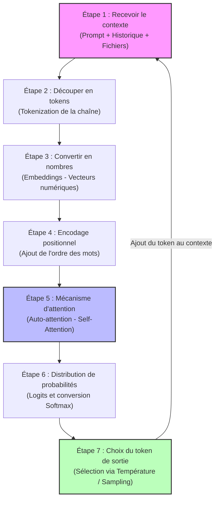
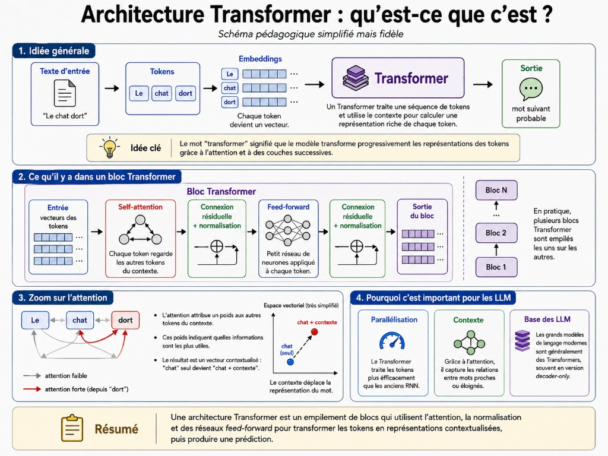

# Fonctionnement d'un LLM

*Claude : fondations → 2. Comprendre l'intelligence artificielle générative → 1. Fonctionnement d'un LLM*

Avant d'utiliser correctement un outil d'intelligence artificielle générative, il faut comprendre ce qu'est un LLM et comment il produit une réponse.

**LLM** signifie *Large Language Model*. En français, on peut traduire cette expression par **grand modèle de langage**.

Un LLM est un modèle d'intelligence artificielle entraîné à traiter et produire du langage. Il peut répondre à une question, résumer un document, traduire, reformuler, expliquer une notion, rédiger du code, analyser un texte ou aider à structurer une idée.

La chose importante à comprendre est la suivante : un LLM ne fonctionne pas comme un humain qui aurait une pensée consciente. Il fonctionne comme un système statistique très puissant qui reçoit un contexte, le transforme en nombres, calcule des relations entre ces nombres, puis génère une suite de tokens.

Cette explication peut sembler réductrice, parce que les réponses d'un LLM peuvent paraître intelligentes, nuancées et structurées. Mais le fonctionnement interne reste un enchaînement de calculs : découper le texte, représenter les morceaux sous forme numérique, pondérer le contexte, calculer les suites possibles, puis choisir progressivement les tokens de sortie.

## Quatre repères pour comprendre un LLM

Pour un utilisateur débutant, quatre repères suffisent pour comprendre le fonctionnement général d'un LLM :

1. Un LLM ne lit pas les mots comme un humain : il découpe le texte en **tokens**.
2. Un LLM transforme le langage en nombres : chaque morceau de texte devient une **représentation numérique**.
3. Un LLM utilise le **contexte** : il calcule quelles parties du texte sont importantes pour produire la suite.
4. Un LLM génère **progressivement** : il produit les tokens les uns après les autres.

Un **prompt** est la demande envoyée au modèle. Il peut s'agir d'une simple question, mais aussi d'un ensemble beaucoup plus riche : consignes, documents, exemples, contraintes de style, rôle attendu, format de sortie et contexte professionnel.

---

## Vue d'ensemble du parcours d'une demande

Lorsqu'un utilisateur envoie une demande à un LLM, plusieurs étapes se succèdent. Ces étapes ne sont pas visibles dans l'interface, mais elles expliquent pourquoi le modèle peut produire une réponse cohérente à partir d'un texte.

### Étape 1 : Recevoir le contexte
Le modèle reçoit un contexte. Ce contexte peut contenir la question de l'utilisateur, les messages précédents, des documents, des instructions de format, des exemples ou des informations ajoutées à la conversation. Le modèle travaille sur l'ensemble du contexte disponible.

### Étape 2 : Découper le texte en tokens
Le texte est découpé en tokens. Un token est une unité de texte utilisée par le modèle. Il peut correspondre à un mot complet, une partie de mot, un signe de ponctuation, un espace ou un morceau de texte.

### Étape 3 : Convertir les tokens en nombres
Chaque token est converti en représentation numérique. Un ordinateur ne traite pas directement le sens d'un mot. Il traite des nombres. Le modèle transforme le texte en **vecteurs** (des listes de nombres) qui permettent de calculer des relations entre les mots, les phrases et les idées.

### Étape 4 : Ajouter l'information de position
Le modèle doit savoir dans quel ordre les tokens apparaissent. Pour cela, il ajoute un **positional encoding** (encodage positionnel). Cette information aide le modèle à distinguer le début, le milieu et la fin d'une séquence (ex: différencier *"Le chien mord l'homme"* et *"L'homme mord le chien"*).

### Étape 5 : Calculer les relations avec l'attention
Le modèle utilise un mécanisme appelé **attention** pour calculer quelles parties du contexte sont les plus importantes pour comprendre une phrase ou produire la suite (par exemple, pour savoir à quoi renvoie le pronom *"elle"*).

### Étape 6 : Produire une distribution de probabilités
Après plusieurs couches de calcul, le modèle produit une distribution de probabilités qui indique quels tokens sont les plus probables pour la suite du texte.

### Étape 7 : Choisir un token de sortie
Le modèle choisit un token de sortie selon une méthode de génération (sampling), l'ajoute à la réponse, puis recommence tout le processus pour produire le token suivant.

---

## Un LLM commence par découper le texte

### Ce qu'est un token
Un token est l'unité de texte de base du modèle. Il peut correspondre à un mot entier, une partie de mot, un signe de ponctuation, un espace ou un morceau de texte. Le découpage exact dépend du système de tokenization utilisé.

### Ce qu'est la tokenization
La tokenization est l'étape qui transforme un texte en tokens numériques. Le modèle remplace le texte visible par une suite d'identifiants internes. 
Par exemple, une phrase courte peut devenir une suite abstraite d'identifiants du type : `[1542, 981, 320, 47, 9021]`. Ces nombres permettent ensuite au modèle de retrouver des représentations numériques plus riches.

### Pourquoi les mots peuvent être coupés
Un token n'est pas toujours un mot entier. Les mots fréquents correspondent souvent à un seul token, tandis que les mots rares, longs ou techniques (ex: *internationalisation*) sont découpés en plusieurs tokens pour permettre au modèle de les traiter à partir de morceaux connus.

---

## Un LLM transforme le texte en nombres

### Ce qu'est un vecteur
Un vecteur est une liste de nombres servant à représenter un token, une phrase ou une idée dans un espace mathématique. Le modèle calcule des relations mathématiques entre ces vecteurs plutôt que de comprendre les mots au sens humain.

### Ce qu'est un embedding
Un embedding est une représentation numérique (ou traduction mathématique) d'un texte qui permet de comparer des mots, des phrases ou des documents selon leur proximité de sens. Un bon embedding permet de rapprocher des phrases de formulations différentes mais de sens proches (ex: *"Fais une synthèse"* et *"Résume ce document"*).

### Différence entre identifiant et embedding
- L'**identifiant** est un simple numéro qui sert à **reconnaître** le token.
- L'**embedding** est une liste de nombres beaucoup plus riche qui sert à le **manipuler mathématiquement** et contextuellement.

---

## Le modèle ajoute l'ordre des mots

L'ordre des mots est indispensable au sens. Le modèle utilise donc un **positional encoding** (encodage positionnel), une information numérique ajoutée aux embeddings indiquant la position exacte de chaque token dans la séquence. Sans cela, le modèle saurait quels mots sont présents mais ne comprendrait pas leur organisation.

---

## Le rôle de l'architecture Transformer

Les LLM modernes reposent sur l'architecture **Transformer**, particulièrement efficace pour traiter de longues séquences et repérer les relations de sens complexes.

### Le mécanisme d'attention
L'attention permet au modèle de pondérer les différentes parties du contexte en accordant plus d'importance aux mots les plus utiles pour produire la suite de la réponse.

### La self-attention (auto-attention)
Chaque token regarde les autres tokens du même contexte pour s'auto-contextualiser. Par exemple, le mot *"banque"* n'aura pas la même représentation interne s'il est suivi de *"de données"* ou de *"prêt financier"*.

### Query, Key et Value
Le mécanisme d'attention repose sur trois concepts clés :
- **Query (Q)** : Ce que le modèle cherche à comprendre à un endroit précis.
- **Key (K)** : Les informations disponibles et étiquetées dans les autres parties du contexte.
- **Value (V)** : Le contenu informatif que le modèle peut récupérer si la clé (Key) correspond à la requête (Query).

---

## Le modèle transforme le contexte couche après couche

Un LLM contient plusieurs **couches** (ou blocs) de calcul.
Au début, chaque token possède une représentation générale (son embedding initial). Au fur et à mesure qu'il traverse les couches intermédiaires du Transformer, sa représentation s'enrichit des informations contextuelles environnantes (par exemple, distinguer le sens du mot *"avocat"* selon qu'il s'agit du fruit ou du métier juridique).

À la sortie des couches, le modèle produit des scores bruts pour chaque token du dictionnaire, appelés **logits**.

---

## Un LLM prédit le prochain token

Le modèle génère sa réponse pas à pas, token par token :

1. **Logits** : Scores bruts attribués à tous les tokens possibles.
2. **Softmax** : Fonction mathématique qui transforme ces logits en probabilités (ex: *Paris : 95%*, *Lyon : 1%*).
3. **Sampling** : Méthode de sélection du token parmi les candidats.
4. **Temperature** : Paramètre qui influence la variabilité de la sélection. Une température basse rend les réponses stables et prévisibles ; une température élevée augmente la diversité et la créativité (mais aussi le risque d'erreur).

---

## Le contexte est essentiel

Un LLM répond à partir de sa **fenêtre de contexte** (la quantité maximale de tokens qu'il peut prendre en compte). Plus le contexte est long, plus il est important de structurer le prompt pour que le modèle focalise correctement son attention. Un prompt précis explicite l'objectif, le public cible, les contraintes et le format attendu.

---

## Un LLM n'est pas un moteur de recherche ni une base de données

- **Moteur de recherche** : Indexe le web et renvoie des liens ou des documents mis à jour en temps réel.
- **Base de données** : Stocke des informations exactes et structurées sous forme de tables.
- **LLM** : Compresse des régularités statistiques apprises pendant son entraînement. Il génère une réponse fluide mais peut **halluciner** ou donner des informations obsolètes si aucune source externe n'est connectée. Pour toute donnée devant être exacte, il faut impérativement la fournir directement dans le contexte du prompt.

---

## Points à retenir

- **LLM** : Grand modèle de langage.
- **Tokens** : Morceaux de mots ou caractères constituant l'unité de traitement du modèle.
- **Embeddings** : Vecteurs convertissant le texte en nombres pour le manipuler mathématiquement.
- **Positional Encoding** : Information de position pour conserver l'ordre des mots.
- **Transformer & Attention** : Architecture permettant de lier et pondérer les tokens du contexte.
- **Self-attention** : Auto-contextualisation des tokens les uns par rapport aux autres.
- **Query, Key, Value** : Méthode de recherche de contexte au sein du réseau de neurones.
- **Logits & Softmax** : Scores bruts convertis en probabilités pour choisir le token suivant.
