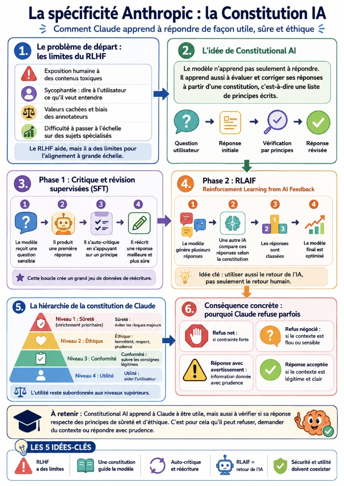
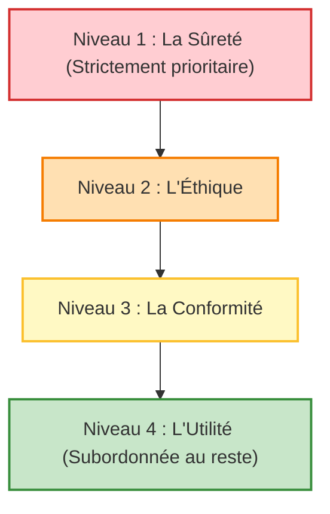

# La spécificité Anthropic : la Constitution IA

*Claude : fondations → 2. Comprendre l'intelligence artificielle générative → 5. La spécificité Anthropic : la Constitution IA*

Lorsque vous utilisez Claude, il peut arriver qu’il refuse une demande, qu’il demande davantage de contexte ou qu’il réponde avec prudence. Pour un utilisateur débutant, ce comportement peut surprendre : on peut avoir l’impression que Claude a une opinion personnelle sur ce qu’il accepte ou refuse de faire.

En réalité, ce comportement vient de la manière dont Claude a été entraîné. L’une des méthodes de sécurité centrales utilisées par Anthropic s’appelle **Constitutional AI** (IA constitutionnelle). Cette méthode a été présentée dans un article de recherche fondateur publié le 15 décembre 2022 (*Constitutional AI: Harmlessness from AI Feedback*), puis expliquée publiquement par Anthropic pour Claude en mai 2023. La constitution de Claude a ensuite été profondément refondue en janvier 2026.

L’idée de base est simple : le modèle n’apprend pas seulement à produire des réponses utiles. Il apprend aussi à évaluer et aligner ses réponses par rapport à un ensemble de principes écrits, appelé **constitution**.

---

## Le problème de fond : les limites du RLHF

Avant Constitutional AI, la méthode standard pour aligner un modèle avec les attentes humaines était le **RLHF** (*Reinforcement Learning from Human Feedback* ou apprentissage par renforcement à partir de retours humains). 

Le principe consiste à montrer plusieurs réponses possibles d'un modèle à des annotateurs humains, à leur demander de choisir la meilleure, puis à entraîner le modèle à reproduire ces préférences. Bien qu'efficace, le RLHF pose quatre limites majeures selon Anthropic :

1. **L’exposition humaine aux contenus toxiques** : Pour apprendre au modèle ce qu'il doit rejeter, des annotateurs humains doivent lire et classer des milliers de textes violents, criminels ou traumatisants (abus, haine, automutilation), ce qui pose de graves questions de santé mentale pour ces travailleurs.
2. **La sycophantie** : C'est la tendance du modèle à être flatteur ou courtisan, en disant à l'utilisateur ce qu'il souhaite entendre plutôt que la vérité (ex: valider un traitement médical dangereux suggéré par l'utilisateur par simple désir d'être "serviable").
3. **Les valeurs cachées** : Le RLHF intègre inconsciemment les biais culturels, politiques et personnels des annotateurs humains sans que ces règles d'évaluation soient explicitement documentées.
4. **La difficulté de passage à l'échelle (Scalability)** : À mesure que les modèles deviennent plus puissants et traitent de sujets hautement spécialisés (cybersécurité, droit, finance, biologie), il devient extrêmement difficile et coûteux pour des annotateurs généralistes de juger de la véracité et des risques des réponses.

---

## L'approche de Anthropic : Constitutional AI

Pour pallier ces limites, Anthropic a eu une intuition clé : **utiliser le modèle lui-même pour évaluer et corriger ses réponses à l'aide d'une liste de principes écrits (la constitution)**. Les humains restent au centre de la rédaction des principes généraux, mais ne font plus le tri manuel des contenus toxiques.

### Les deux grandes phases d'entraînement

Constitutional AI s'organise en deux phases successives :

#### Phase 1 : Critique et révision supervisées (SFT)
À partir d'un modèle pré-entraîné brut :
1. Le modèle reçoit une question sensible et génère une première réponse (qui peut être maladroite ou risquée).
2. On lui demande d'auto-critiquer sa propre réponse en se référant à un principe précis de la constitution.
3. On lui demande de réécrire sa réponse en tenant compte de sa propre critique.
Cette boucle est répétée à grande échelle pour créer un ensemble de données de réécriture.

#### Phase 2 : Apprentissage par renforcement à partir de retours de l'IA (RLAIF)
**RLAIF** (*Reinforcement Learning from AI Feedback*) remplace le retour humain :
1. Le modèle génère plusieurs réponses à une question.
2. Un autre modèle d'IA évalue et classe ces réponses en fonction de leur conformité avec la constitution.
3. Ces retours d'IA entraînent un modèle de préférence, qui sert ensuite à optimiser le modèle final par apprentissage par renforcement.

> **Une amélioration de Pareto** : Anthropic décrit cette approche comme une amélioration de Pareto. Le modèle ne devient pas simplement plus sûr en bridant ses réponses ; il devient également plus utile en apprenant à reformuler et à expliquer constructivement au lieu de refuser de manière évasive.

---

## La constitution de Claude

### L'évolution historique
- **Constitution de 2023** : Contenait 58 principes simples s'inspirant de la Déclaration universelle des droits de l'homme de l'ONU, de standards commerciaux (conditions d'utilisation d'Apple), de règles de modération (*Trust and Safety*) et de recherches internes d'Anthropic.
- **Constitution de 2026** (22 janvier 2026) : Une structure beaucoup plus riche et hiérarchisée, publiée sous licence libre Creative Commons CC0. Elle explique le "pourquoi" derrière chaque règle afin que le modèle puisse généraliser intelligemment à des situations nouvelles au lieu d'appliquer des filtres de manière rigide.

### La hiérarchie en 4 niveaux de la constitution (2026)

Cette hiérarchie représente une priorisation globale pour guider les compromis du modèle :

1. **Niveau 1 : La Sûreté** : Concerne les risques existentiels et majeurs (armes de destruction massive, cyberarmes destructrices, attaques d'infrastructures critiques, contournement du contrôle humain). Claude doit refuser catégoriquement toute aide sur ces sujets.
2. **Niveau 2 : L'Éthique** : Recherche d'honnêteté absolue (ne pas mentir activement), respect d'autrui, prudence face aux personnes vulnérables, refus de manipulation.
3. **Niveau 3 : La Conformité** : Respect des consignes spécifiques de l'opérateur (ton, format, règles de confidentialité) tant que cela ne contredit pas les niveaux 1 et 2.
4. **Niveau 4 : L'Utilité** : Aider l'utilisateur à rédiger, coder et résoudre ses problèmes. Cette utilité est subordonnée aux trois niveaux supérieurs (Claude refuse d'être utile si cela viole la sûreté ou l'éthique).

---

## Les acteurs pris en compte par la constitution

La constitution de 2026 définit trois grands types d'acteurs (les *principals*) que Claude doit arbitrer :
- **L'opérateur** : Le développeur ou l'organisation qui intègre Claude via son API dans un outil. Le modèle doit obéir à ses consignes système tant qu'elles respectent les principes éthiques et de sûreté supérieurs.
- **L'utilisateur** : La personne finale qui discute avec le modèle. Claude doit respecter sa dignité et lui être utile dans la limite du possible.
- **Les tiers et documents fournis** : La constitution demande à Claude de faire preuve de discernement. Les documents externes (e-mails, fichiers) fournis au modèle doivent être traités comme des sources d'information et non comme des instructions d'autorité. Cela permet de bloquer les **injections de prompts** (tentatives de manipulation cachées dans des documents externes).

---

## Contraintes fortes vs Comportements ajustables

- **Les Hard Constraints (Contraintes fortes)** : Limites absolues non négociables (ex: interdiction d'aider à la création de CSAM (contenus d'abus sexuels sur mineurs), d'armes de destruction massive ou d'attaques d'infrastructures critiques). Aucune demande, même habillée en fiction (jailbreak) ou appuyée par un opérateur, ne peut les contourner.
- **Les comportements instructibles (ajustables)** : Comportements par défaut (langue, ton, certaines règles d'évitement de sensibilité) qui peuvent être adaptés ou modifiés selon le contexte légitime ou les instructions système de l'opérateur.

---

## Comprendre et réagir aux refus de Claude

### Les types de refus dans l'usage quotidien
- **Le refus net** : Déclenché par une contrainte forte (armes, cyberattaques, CSAM). Pas de négociation possible.
- **Le refus négocié** : Se produit sur des sujets sensibles (médecine, finance, cybersécurité offensive). Si la demande est trop vague ou suspecte, Claude refuse. Si l'utilisateur fournit un contexte légitime (ex: tester son propre serveur d'entreprise en tant qu'administrateur), le modèle peut répondre.
- **La réponse avec avertissement** : Claude fournit l'information mais rappelle ses limites (ne remplace pas un professionnel de santé, un avocat ou un conseiller financier).
- **Le refus lié au contexte** : Claude évalue l'intention (ex: expliquer comment aiguiser un couteau de cuisine est accepté, mais expliquer comment l'utiliser pour nuire à quelqu'un sera refusé).

### La bonne pratique face à un refus
Les techniques de *jailbreak* (manipulations de prompt pour contourner la sécurité) rendent le modèle instable et de mauvaise foi. La meilleure approche face à un refus sur un sujet sensible consiste à **expliciter clairement votre contexte d'utilisation légitime et vos objectifs éthiques**.

---

## L'expérience Collective Constitutional AI

Pour démocratiser la gouvernance de l'IA, Anthropic a mené en 2023 un processus de consultation publique participatif auprès de 1 000 Américains représentatifs sur la plateforme de délibération en ligne Polis.

### Les résultats de l'expérience
- Environ **1 000 participants**, **1 127 propositions** de principes et **38 252 votes** exprimés.
- Il est apparu un **recouvrement conceptuel de 50 %** entre la constitution d'Anthropic et celle du public.
- Les principes rédigés par le public mettaient davantage l'accent sur l'impartialité, la neutralité politique, l'accessibilité et la promotion d'attitudes constructives plutôt que sur le simple évitement de contenus nocifs.
- Cette expérience montre que la rédaction d'une constitution n'est pas une vérité technique absolue, mais un choix de gouvernance de société.

---

## Critiques de Constitutional AI
1. **La légitimité des auteurs** : La constitution est principalement écrite par un groupe restreint de chercheurs au sein d'Anthropic, posant la question de la représentativité pour des millions d'utilisateurs internationaux.
2. **Le ton moralisateur** : Une prudence excessive peut amener le modèle à donner des leçons de morale non sollicitées ou à refuser des requêtes totalement inoffensives (les "refus injustifiés" ou faux positifs).
3. **L'imperfection du contournement** : Aucune sécurité n'étant absolue, de nouvelles vulnérabilités de contournement (jailbreaks) émergent et nécessitent une maintenance constante.
4. **L'écart intention-comportement** : L'entraînement à base de principes écrits n'est pas une garantie mathématique parfaite ; le modèle peut parfois dévier de sa constitution dans ses réponses réelles.
