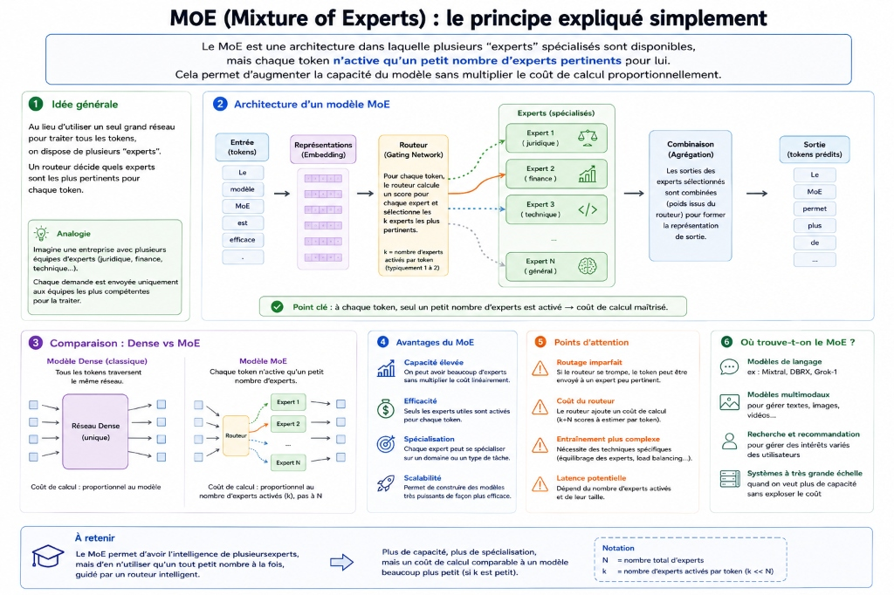
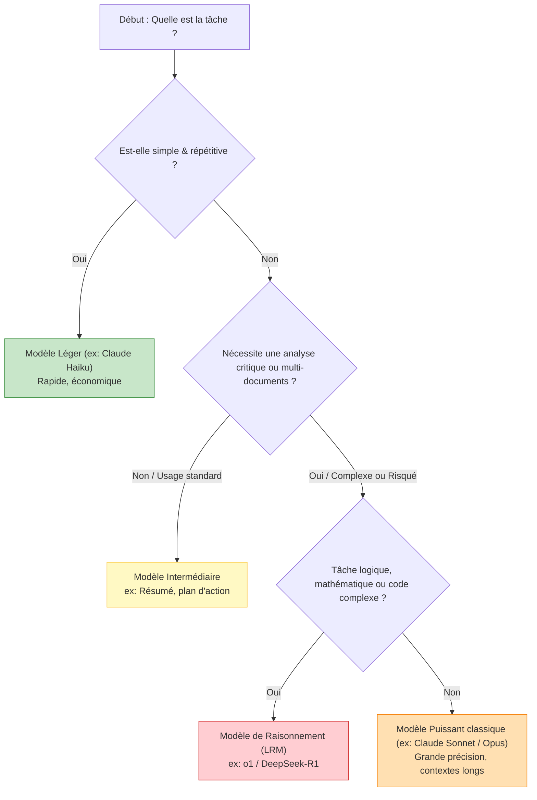

| Indices / questions clés | Notes détaillées |
|---|---|
| Que sont les paramètres (weights) ? | Valeurs numériques internes ajustées pendant l'entraînement. Les connaissances du modèle sont **distribuées** à travers ces poids, et non stockées dans une base de données de faits isolés. |
| Quel est le compromis Taille / Vitesse / Coût ? | - **Légers** : Très rapides, très économiques, pour tâches basiques (classement, extraction courte). - **Intermédiaires** : Bon compromis vitesse/coût pour résumés, plans d'action. - **Puissants** : Lents, coûteux, pour analyses juridiques/financières et code complexe. |
| Qu'est-ce qu'une architecture MoE ? | *Mixture of Experts* : Modèle composé d'experts spécialisés. Pour chaque token, seule une fraction d'experts est activée, optimisant la puissance sans faire exploser le coût computationnel. |
| Quel est le rôle du post-training ? | Ajustement fin (SFT + Alignement) qui enseigne au modèle le suivi strict des contraintes multiples, le respect des formats complexes (JSON) et adapte le ton (prudence, neutralité). |
| Qu'est-ce qu'un modèle d'embedding ? | Modèle non conversationnel conçu pour transformer du texte en vecteurs (représentation numérique) afin d'alimenter les moteurs de recherche sémantique ou les systèmes **RAG**. |
| Comment choisir son modèle ? | Arbitrer selon la complexité et le niveau de risque de la tâche : utiliser un modèle léger pour les tâches massives ou répétitives simples ; réserver les modèles de raisonnement (LRM) pour les logiques multi-étapes et audits. |

## Synthèse
Les performances des LLM ne dépendent pas uniquement du nombre de paramètres (poids distribués), mais aussi de la qualité de l'entraînement et de l'architecture. Le choix du modèle en entreprise repose sur un arbitrage strict entre la qualité requise, la latence et le coût, en orientant les tâches simples et massives vers des modèles légers (ou architectures MoE économiques) et en réservant les modèles puissants et de raisonnement (LRM) aux audits complexes et tâches de programmation sensibles.

## Glossaire
- **Dense (Modèle)** : Architecture de modèle où la quasi-totalité des paramètres est mobilisée et calculée pour chaque token généré.
- **Embedding** : Vecteur de nombres réels représentant la signification sémantique d'un texte, d'une image ou d'un document.
- **MoE (Mixture of Experts)** : Architecture de mélange d'experts activant dynamiquement une sous-partie du modèle pour chaque token traité.
- **Paramètre (Weight)** : Poids numérique ajusté pendant la phase d'apprentissage d'un réseau de neurones, dictant les relations statistiques entre les tokens.
- **Raisonnement multi-étapes** : Capacité d'un modèle à enchaîner plusieurs opérations logiques successives pour résoudre un problème complexe.
- **Test-time compute** : Temps et ressources de calcul supplémentaires mobilisés à l'inférence par un modèle de raisonnement pour valider ses étapes logiques.

## Questions d'auto-évaluation
1. Pourquoi un modèle avec un grand nombre de paramètres n'est-il pas systématiquement le plus performant pour une tâche donnée ?
2. Quelle différence de fonctionnement majeur y a-t-il entre un modèle de conversation classique et un modèle d'embedding ?
3. Comment l'architecture MoE parvient-elle à réduire la facture de calcul par requête ?

# Les gammes de modèles et leurs performances

**Durée : 18 minutes**

## Notes

Voici l'infographie récapitulative présentant les gammes de modèles et leurs performances :

Voici le schéma explicatif de l'architecture MoE (Mixture of Experts) :

### Arbre de décision pour la sélection du modèle

## Points clés

- Les **connaissances** d'un LLM ne sont pas stockées dans une base de données, mais sont **distribuées mathématiquement** à travers ses paramètres (weights).
- Le compromis **Qualité-Vitesse-Coût** oriente la sélection du modèle.
- L'architecture **MoE** (Mixture of Experts) active uniquement des sous-parties du modèle par token pour contrôler le coût.
- Les **données d'entraînement** de haute qualité (nettoyées et diversifiées) sont plus importantes qu'un grand nombre de paramètres bruts.
- Les **modèles de raisonnement** sont performants pour les tâches multi-étapes ou sous contraintes, mais induisent une **latence plus élevée** (test-time compute).
