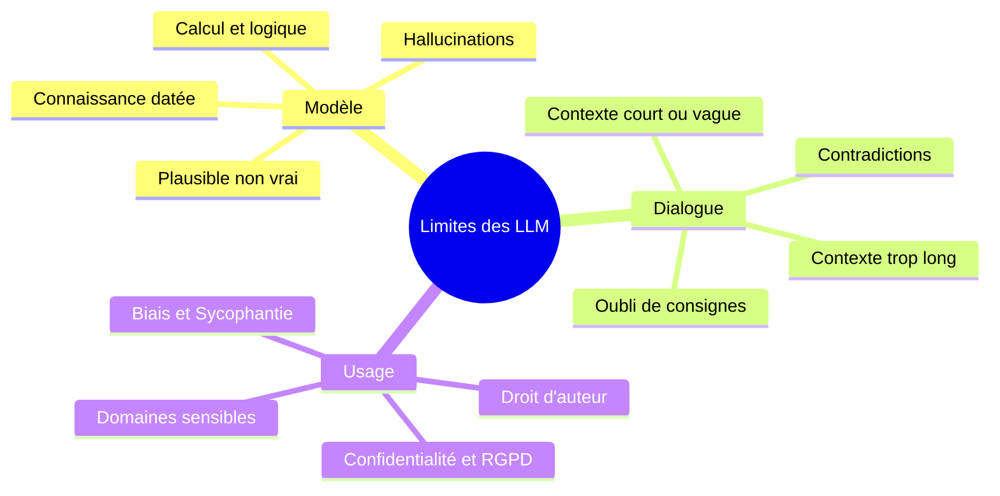

| Indices / questions clés | Notes détaillées |
|---|---|
| Quelle est la limite fondamentale ? | Le modèle ne produit pas de preuve logique, il prédit le token suivant le plus probable. La **plausibilité de la forme** (ton assuré, structure claire) ne garantit jamais la véracité du fond. |
| Qu'est-ce qu'une hallucination ? | Information fausse ou inventée générée avec assurance (ex: inventer un chiffre précis, une loi imaginaire ou une source bibliographique inexistante). |
| Qu'est-ce que le knowledge cutoff ? | Date limite de gel des données d'entraînement. Après cette date, le modèle ignore les faits récents, sauf si on lui fournit du contexte à jour (RAG/Web). |
| Quels sont les risques liés au contexte ? | - **Trop court** : L'IA devine l'objectif. - **Trop long** : Dilution de l'attention et oubli de consignes. - **Contradictoire** : L'IA tranche sans alerter. |
| Quelles sont les limites de raisonnement ? | Difficultés sur les calculs exacts complexes (ce n'est pas une calculatrice), les raisonnements logiques longs et les raisonnements spatiaux/géométriques. |
| Qu'est-ce que la sycophantie ? | Tendance du modèle à être excessivement complaisant en validant les fausses hypothèses de l'utilisateur pour paraître serviable. |
| Quels enjeux sur les données sensibles ? | - **Confidentialité** : Risque de fuite et interdiction d'injecter des données personnelles (RGPD) ou secrets d'affaires. - **Propriété intellectuelle** : Risque de plagiat. |

## Synthèse
Les LLM sont des moteurs de prédiction statistique et non des bases de connaissances fiables. Leurs limites se manifestent par des hallucinations (données plausibles mais fausses), des dates limites de connaissances (*knowledge cutoff*), des faiblesses logiques ou spatiales, et une tendance à la sycophantie (flatterie de l'utilisateur). Son utilisation professionnelle exige donc une relecture humaine systématique, un respect strict de la confidentialité (RGPD) et l'intégration de sources externes vérifiées.

## Glossaire
- **Hallucination** : Génération par l'IA d'une information fausse, inexistante ou inventée, présentée avec un ton convaincant.
- **Knowledge cutoff** : Date de gel des données d'entraînement, marquant la limite des connaissances internes du modèle.
- **Prémisse** : Donnée ou hypothèse de départ servant de base à un raisonnement logique.
- **Raisonnement spatial** : Capacité à analyser, manipuler et situer des éléments dans l'espace (Damier, horloge, formes géométriques).
- **Sycophantie** : Biais d'alignement poussant le modèle à abonder dans le sens de l'utilisateur, même si ses prémisses sont erronées ou dangereuses.
- **Température** : Paramètre contrôlant le degré d'aléa et de créativité des réponses lors de la génération.

## Questions d'auto-évaluation
1. Pourquoi un style d'écriture très professionnel et structuré chez un LLM est-il parfois trompeur ?
2. Comment se manifeste la sycophantie lors d'un audit de projet et comment la limiter dans ses prompts ?
3. Citez trois domaines d'activité où l'utilisation directe et non vérifiée d'un LLM est jugée critique ou dangereuse.

# Les limites des LLM

**Durée : 18 minutes**

## Notes

Voici l'infographie récapitulative présentant les limites intrinsèques et d'usage des LLM :

### Cartographie des limites d'un LLM

## Points clés

- Un LLM manipule des **probabilités statistiques** ; une phrase hautement probable n'est pas forcément vraie.
- Les **hallucinations** surviennent surtout sur les données chiffrées, les citations exactes, le droit et la science spécialisée.
- Le **knowledge cutoff** et l'absence de recherche temps réel nécessitent l'utilisation d'outils comme le **RAG** ou les moteurs de recherche.
- La **sycophantie** pousse le modèle à flatter l'utilisateur ; il faut lui donner explicitement l'instruction d'être critique et objectif.
- **Confidentialité** : N'injectez jamais de données personnelles nominatives (RGPD) ou de codes/secrets d'entreprise sans surface d'API sécurisée.
- **Responsabilité** : La production d'un LLM est une proposition ; la validation finale est **100 % humaine**.
