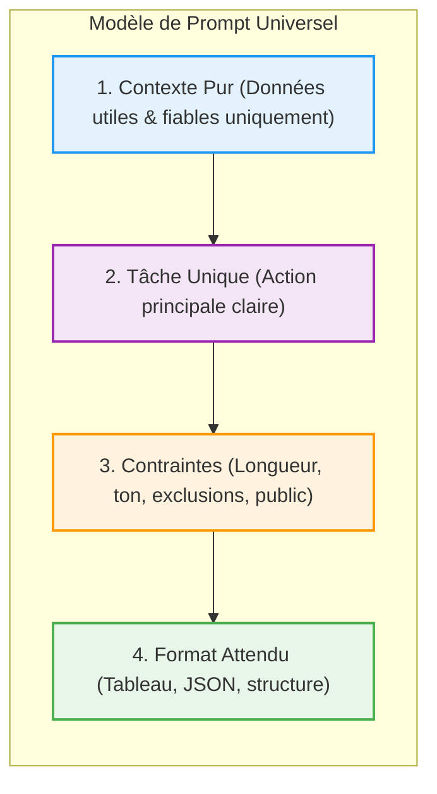

| Indices / questions clés | Notes détaillées |
|---|---|
| Qu'est-ce que la densité informationnelle ? | Rapport entre informations utiles (objectifs, contraintes, format) et volume total du prompt. Un prompt efficace doit être dense, pas forcément long. |
| Qu'est-ce qu'un contexte pur ? | Un contexte expurgé de tout bruit (anciennes notes, doublons, contradictions). Le bruit nuit à la précision de l'attention du modèle. |
| Pourquoi limiter à une tâche unique ? | Réduit le risque d'oubli de contraintes et évite les réponses superficielles. Les tâches complexes doivent être découpées en plusieurs prompts. |
| Quel est le modèle de prompt universel ? | **Contexte pur** (données fiables) + **Tâche unique** (action) + **Contraintes** (ton, longueur, exclusions) + **Format attendu** (tableau, JSON). |
| Comment gérer les incertitudes ? | Demander d'isoler dans la réponse : **faits établis** / **hypothèses** / **points à vérifier**. Obligatoire sur les sujets sensibles. |
| Pourquoi utiliser des exemples (Few-Shot) ? | Les modèles imitent plus facilement une structure visible (un exemple de tableau) qu'une consigne textuelle abstraite. |

## Synthèse
Pour maximiser la qualité des réponses d'un LLM, les prompts doivent être denses (contenant uniquement des informations ayant un impact sur la réponse) et purs (libres de tout bruit historique ou contradictoire). Structurer ses demandes autour d'une tâche unique par requête en appliquant la formule "Contexte + Tâche + Contraintes + Format", utiliser le chaînage de prompts pour les analyses complexes, et fournir des exemples de sorties garantissent des résultats fiables et exploitables en entreprise.

## Glossaire
- **Chaînage de prompts** : Technique consistant à décomposer une tâche complexe en une suite de prompts successifs (ex: analyser puis décider puis rédiger).
- **Densité informationnelle** : Quantité de détails pertinents et opérationnels par token dans un prompt.
- **Few-Shot Prompting** : Technique consistant à fournir un ou plusieurs exemples de paires entrée/sortie dans le prompt pour guider le format du modèle.
- **Prompting** : Art et technique de formulation des instructions (prompts) destinées à guider un modèle d'IA.
- **RAG (Retrieval-Augmented Generation)** : Système de recherche externe ramenant uniquement les extraits utiles de documents pour garder un contexte pur.
- **Sélectivité du contexte** : Action de trier et de filtrer les documents d'entrée pour ne fournir que l'information faisant foi.

## Questions d'auto-évaluation
1. Pourquoi est-il préférable de chaîner plusieurs prompts simples plutôt que de faire une demande complexe multi-tâches ?
2. Comment la structure "Faits établis / Hypothèses / Points à vérifier" aide-t-elle à limiter l'impact des hallucinations ?
3. Quelle est l'utilité du *Few-Shot prompting* sur la structure des données générées ?

# Les bonnes pratiques d'utilisation des LLM

**Durée : 18 minutes**

## Notes

### Structure universelle du prompt efficace

### Le chaînage de prompts pour les tâches complexes

## Points clés

- La **densité** compte plus que la longueur : éliminez le bavardage vague de vos prompts.
- Assurez un **contexte pur** en triant vos documents d'entrée et en éliminant les versions obsolètes ou contradictoires.
- Concentrez-vous sur **une seule action principale** par prompt. Divisez les processus complexes.
- Structurez vos requêtes avec les quatre blocs : **Contexte + Tâche + Contraintes + Format**.
- Utilisez des **exemples réels (Few-Shot)** pour contraindre le format (ex: structure d'un tableau ou JSON).
- Demandez explicitement d'isoler les **incertitudes** (faits vs hypothèses) dans les domaines sensibles.
