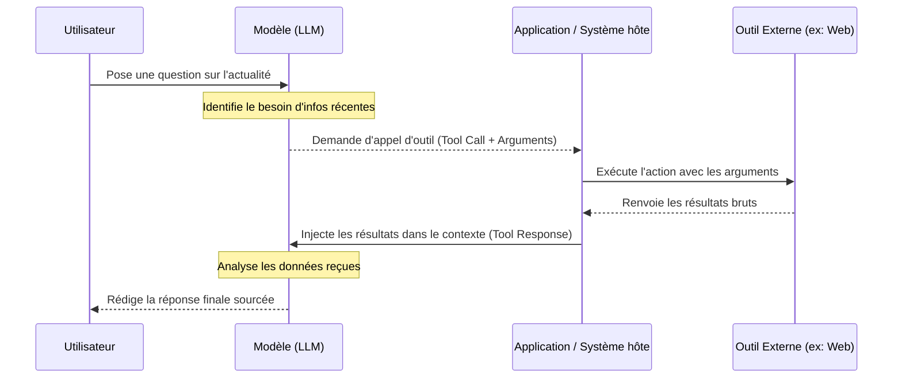

| Indices / questions clés | Notes détaillées |
|---|---|
| Qu'est-ce qu'un outil ? | Capacité externe (API, script, base de données) qu'un LLM peut appeler pour réaliser des actions hors de ses connaissances internes. |
| Comment est décrit un outil ? | Par un **nom**, une **description** (pour que le modèle comprenne son rôle) et un **schéma de paramètres** (JSON Schema définissant le format attendu). |
| Comment se déroule l'appel d'outil ? | 1. Le modèle génère un **tool call** avec des arguments. 2. L'application exécute l'action côté serveur. 3. Le résultat est renvoyé en entrée de l'IA (tool response). |
| Quels sont les types d'outils courants ? | Recherche web, requêtes SQL (base de données), calculatrices, outils système (Slack, e-mail) et interpréteurs de code (Python). |
| Quels sont les enjeux de sécurité ? | Nécessité d'encadrer les permissions d'action, de valider la sécurité des données reçues et d'auditer les résultats renvoyés au modèle. |
| En quoi est-ce une transition vers l'agent ? | L'usage d'outils fait passer le modèle d'un rôle d'assistant conversationnel passif à un système actif capable de modifier son environnement ou de chercher des faits. |

## Synthèse
Un outil (ou *function calling*) connecte un LLM à des actions ou des sources de données extérieures. Le modèle ne lance pas lui-même l'outil ; il émet une demande structurée contenant des arguments précis, que le système hôte exécute avant de lui renvoyer le résultat. Bien que puissants pour contourner la limite de temps (*cutoff*) ou effectuer des calculs fiables, les outils exigent un contrôle strict des permissions et une analyse critique des données récupérées.

## Glossaire
- **Appel d'outil (Tool Call)** : Demande structurée émise par le LLM contenant le nom de l'outil et les arguments requis pour son exécution.
- **Function Calling** : Capacité native d'un LLM à structurer une sortie sous forme d'arguments d'API ou de fonctions de code.
- **JSON Schema** : Format standardisé décrivant la structure des données attendues par l'outil pour que le modèle puisse s'y conformer.
- **Réponse d'outil (Tool Response)** : Résultat d'exécution de l'outil renvoyé par l'application pour enrichir le contexte d'entrée du LLM.
- **Système hôte** : Application ou serveur exécutant le code d'intégration du modèle et gérant l'appel physique des outils.

## Questions d'auto-évaluation
1. Qui exécute réellement le code d'un outil (comme une recherche web ou l'envoi d'un e-mail) : le LLM lui-même ou l'application hôte ?
2. Pourquoi la description textuelle d'un outil dans l'API est-elle cruciale pour sa bonne utilisation par l'IA ?
3. Citez un risque de sécurité majeur si l'on donne à un modèle un accès direct en écriture à une base de données sans contrôle intermédiaire.

# Qu'est-ce qu'un outil ?

**Durée : 13 minutes**

## Notes

### Flux d'exécution d'un appel d'outil (Tool Use)

## Points clés

- Les LLM n'ont **pas d'accès direct** à Internet ou aux fichiers par défaut ; ils ont besoin d'outils intermédiaires.
- L'IA utilise les descriptions des outils pour décider **quand** et **comment** les appeler.
- Le cycle de vie d'un outil : **Appel d'outil (modèle) -> Exécution (système hôte) -> Réponse d'outil (injectée au contexte) -> Réponse finale (modèle)**.
- Les outils fiabilisent le modèle (calculatrices pour les mathématiques, RAG pour l'information récente).
- **Sécurité** : Les actions sensibles (écritures, suppressions, envois de messages) doivent être gouvernées par des logs et des validations humaines.
