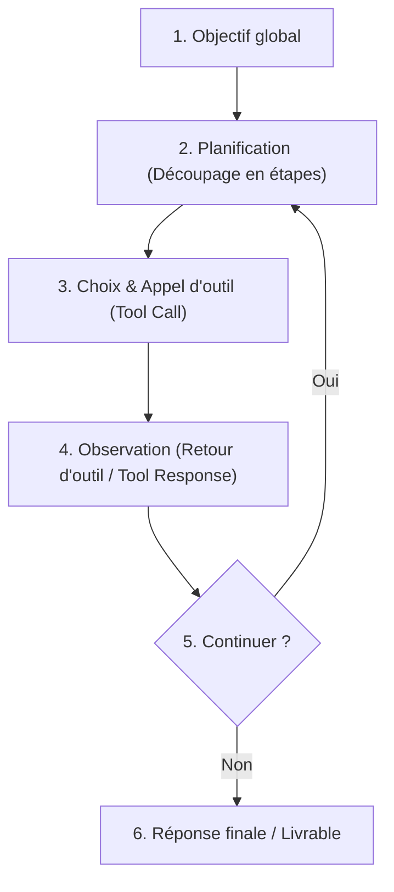

| Indices / questions clés | Notes détaillées |
|---|---|
| Quelle est la différence LLM vs Agent ? | Un LLM produit du texte de manière passive. Un **agent** organise et exécute une séquence d'actions autonomes pour atteindre un objectif global. |
| Comment fonctionne la boucle agentique ? | Cycle en 6 étapes : Comprendre l'objectif $\rightarrow$ Planifier $\rightarrow$ Choisir une action $\rightarrow$ Appeler un outil $\rightarrow$ Observer le résultat $\rightarrow$ Décider de continuer ou s'arrêter. |
| Comment gérer les permissions ? | Séparer strictement les droits : Lecture (faible risque) $\rightarrow$ Écriture (modéré) $\rightarrow$ Modification (élevé) $\rightarrow$ Suppression et Envoi/Publication (critiques). |
| Qu'est-ce que le mode Review-then-execute ? | *Relire puis exécuter* : L'agent prépare l'action (e-mail, virement), mais attend une confirmation physique et manuelle de l'utilisateur humain. |
| Différence entre Agent et RPA ? | - **RPA (Automatisation)** : Règles fixes de type *Si/Alors*, prévisible et déterministe. - **Agent** : Logique floue, s'adapte au contexte linguistique, moins prévisible. |
| Quels sont les risques agentiques ? | Mauvais choix d'outils, arguments incorrects, boucles infinies de requêtes (exigeant un critère d'arrêt) et injections de prompts indirectes. |

## Synthèse
Un agent s'appuie sur le LLM comme moteur de décision pour accomplir des tâches complexes en boucle fermée (observation, décision, action). Contrairement aux automatisations classiques (RPA) rigides et déterministes, l'agent gère l'ambiguïté du langage. Cependant, cette flexibilité introduit de nouveaux risques (boucles infinies, mauvaise utilisation d'outils) qui imposent d'encadrer l'agent par des permissions d'écriture et de suppression sous contrôle humain (*human-in-the-loop*).

## Glossaire
- **Boucle agentique** : Processus itératif par lequel un agent planifie, exécute des actions via des outils et s'auto-corrige jusqu'à l'atteinte de son but.
- **Critère d'arrêt** : Condition de sécurité limitant le nombre de boucles ou de tokens alloués à un agent pour éviter les coûts infinis.
- **Déterministe** : Propriété d'un système qui produit exactement les mêmes sorties pour les mêmes entrées (comme les automatisations RPA).
- **Human-in-the-loop (Humain dans la boucle)** : Modèle de conception intégrant une validation humaine obligatoire à des étapes clés d'un workflow autonome.
- **RPA (Robotic Process Automation)** : Automatisation robotisée de processus basée sur des règles métiers strictes et prévisibles.

## Questions d'auto-évaluation
1. Pourquoi une boucle agentique nécessite-t-elle obligatoirement la définition d'un *critère d'arrêt* ?
2. Quelle est la différence majeure entre un agent de Niveau 2 (Lecteur) et un agent de Niveau 5 (Exécuteur) ?
3. Dans quel cas de figure professionnel est-il préférable d'utiliser une automatisation classique (RPA) plutôt qu'un agent autonome ?

# Qu'est-ce qu'un agent ?

**Durée : 12 minutes**

## Notes

### Cycle de la boucle agentique

## Points clés

- Un agent combine un **LLM**, des **outils**, une **boucle d'action**, des **permissions** et un **contrôle humain**.
- La boucle agentique : **Comprendre -> Planifier -> Choisir -> Appeler -> Observer -> Décider**.
- Les actions irréversibles (suppression, envoi, publication) exigent le mode **Review-then-execute** (*human-in-the-loop*).
- Si la tâche est simple, stable et répétitive, l'**automatisation classique (RPA)** est plus fiable et économique qu'un agent.
- Les agents sont exposés aux **injections de prompts indirectes** lorsqu'ils lisent des documents externes non sécurisés.
- Définir des **critères d'arrêt** stricts évite les dérives financières de boucle infinie.
