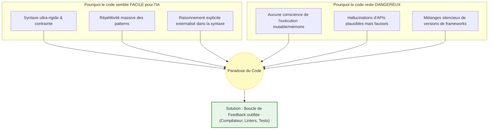

| Indices / questions clés | Notes détaillées |
|---|---|
| Pourquoi le code est-il facile à prédire ? | C'est un langage artificiel très contraint par une syntaxe stricte. Les choix probabilistes de mots-clés (`if`, `for`) après une instruction sont réduits. |
| Qu'est-ce que l'illusion de compréhension ? | L'IA assemble des patterns statistiques appris sur Open Source, sans avoir de notion sémantique de l'exécution (mémoire, états mutables, compilation). |
| Qu'est-ce qu'une hallucination de code ? | Écriture d'APIs plausibles mais inexistantes ou mélanges de signatures de versions incompatibles d'un framework. |
| Pourquoi le raisonnement est-il "externalisé" ? | Le raisonnement logique est directement visible et matérialisé par la syntaxe du code (boucles, conditions), limitant les implicites du langage naturel. |
| Pourquoi est-ce le meilleur terrain pour l'IA ? | Le code est **évaluable de manière déterministe**. On peut l'exécuter, le compiler et tester ses limites via des tests automatiques de validation. |
| Quelle est la posture du développeur ? | Posture de scepticisme outillé : le développeur reste responsable du code et s'appuie sur la validation par tests et linters, et non sur la confiance visuelle. |

## Synthèse
Le code est un domaine de prédilection pour les LLM car sa structure syntaxique est hautement contrainte, répétitive et dépourvue des ambiguïtés sémantiques propres au langage naturel. Cependant, cette fluidité masque une absence totale de conscience de l'exécution, provoquant des hallucinations d'APIs subtiles. Paradoxalement, le caractère déterministe et testable du code en fait le terrain idéal pour les agents autonomes de développement qui s'auto-corrigent en intégrant les retours de compilateurs.

## Glossaire
- **Complétion locale** : Capacité d'un modèle à prédire les lignes de code immédiatement consécutives à partir du contexte syntaxique direct.
- **Convention sociale (Code)** : Règles implicites de nommage et d'organisation des fichiers adoptées par les développeurs pour maximiser la lisibilité humaine.
- **Hallucination d'API** : Génération par l'IA d'une fonction, d'une classe ou de paramètres logiques mais inexistants dans la bibliothèque de code ciblée.
- **Idiomatique (Code)** : Écriture respectant les meilleures pratiques, structures et expressions naturelles propres à un langage ou framework donné.
- **Linter** : Outil d'analyse statique de code permettant de détecter les erreurs de syntaxe, les bugs potentiels et le non-respect des règles de style.

## Questions d'auto-évaluation
1. Pourquoi un code syntaxiquement parfait généré par un LLM peut-il s'avérer totalement faux ou dysfonctionnel à l'exécution ?
2. En quoi les "conventions sociales" d'écriture des développeurs facilitent-elles le travail de complétion statistique d'un LLM ?
3. Comment les agents de développement (comme Claude Code) tirent-ils parti de la nature déterministe du code pour s'auto-corriger ?

# Pourquoi le code est un cas à part pour les LLM

**Durée : 19 minutes**

## Notes

### Le paradoxe du code pour les LLM

## Points clés

- La syntaxe stricte du code réduit le nombre de continuations de tokens plausibles statistiquement (complétion locale facilitée).
- L'IA reproduit des **patterns idiomatiques** (contrôleur REST, tests) sans comprendre les intentions métiers de l'application.
- Le code matérialise explicitement les décisions logiques (boucles, types), allégeant le besoin d'inférence sémantique par rapport au texte libre.
- **Hallucinations d'APIs** : Des fonctions inexistantes bien écrites et commentées qui n'apparaissent fausses qu'à la compilation.
- La **vérifiabilité déterministe** du code (compiles/tests) permet le fonctionnement d'outils agentiques d'auto-correction.
- **Règle absolue** : La revue de code humaine, l'analyse statique (linters) et les suites de tests unitaires sont indispensables.
