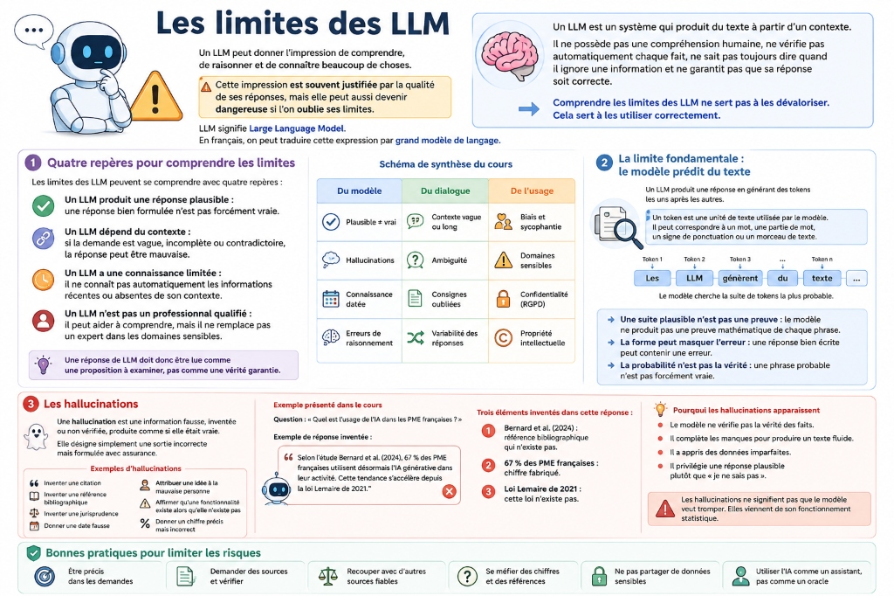

# Les limites des LLM

*Claude : fondations → 3. Fonctionnalités, limites et bonnes pratiques → 2. Les limites des LLM*

Un LLM peut donner l’impression de comprendre, de raisonner et de connaître beaucoup de choses. L’impression est souvent justifiée par la qualité de ses réponses, mais elle peut aussi devenir dangereuse si l’on oublie ses limites fondamentales.

Un LLM est un système qui produit du texte à partir d’un contexte. Il ne possède pas une compréhension humaine, ne vérifie pas automatiquement chaque fait, ne sait pas toujours exprimer quand il ignore une information, et ne garantit pas que sa réponse soit correcte.

Comprendre les limites des LLM ne sert pas à les dévaloriser. Cela sert à les utiliser correctement.

---

## Quatre repères pour comprendre les limites

1. **Un LLM produit une réponse plausible** : Une réponse fluide et bien formulée n'est pas nécessairement vraie.
2. **Un LLM dépend étroitement du contexte** : Si la demande est vague, incomplète ou contradictoire, la réponse sera altérée.
3. **Un LLM a une connaissance limitée dans le temps** : Il ne connaît pas automatiquement les informations récentes ou absentes de ses données d'entraînement.
4. **Un LLM n’est pas un professionnel qualifié** : Il peut aider à vulgariser ou comprendre, mais il ne remplace pas un expert dans les domaines sensibles (médecine, droit, finance).

Une réponse de LLM doit donc être lue comme une proposition à examiner, pas comme une vérité garantie.

---

## Vue d'ensemble des limites

Les limites des LLM se situent à trois niveaux principaux :

| Catégorie | Types de limites | Exemples |
|---|---|---|
| **Du modèle lui-même** | - Plausible ≠ vrai - Hallucinations - Connaissance datée - Erreurs de raisonnement | - Citations scientifiques inventées. - Données après le *knowledge cutoff*. - Calculs mathématiques erronés. |
| **Du dialogue** | - Contexte vague ou trop long - Ambiguïté linguistique/d'objectif - Consignes oubliées - Variabilité des réponses | - Oubli d'une règle dans un prompt dense. - Incompréhension de mots polysémiques. - Variation de réponse selon la *température*. |
| **De l'usage** | - Biais et sycophantie - Domaines sensibles (médical, juridique) - Confidentialité et RGPD - Propriété intellectuelle | - Fuite de données personnelles. - Recopie de code ou textes protégés. - Flatterie excessive (*sycophantie*). |

---

## La limite fondamentale : le modèle prédit du texte

### Une suite plausible n’est pas une preuve
Le modèle cherche à produire une suite de texte cohérente avec le contexte. Cette suite peut être excellente, claire, structurée et utile, mais elle peut aussi être fausse. Le modèle ne produit pas une démonstration logique de chaque phrase. Il produit la réponse la plus probable statistiquement.

### La forme peut masquer l’erreur
Un LLM peut répondre avec un style très assuré, en utilisant une structure claire, des titres, des exemples, des chiffres précis et un ton professionnel. Cette qualité de forme peut donner une impression de fiabilité infaillible, mais la forme ne garantit jamais le fond.

---

## Les hallucinations

Une hallucination est une **information fausse, inventée ou non vérifiée, produite par le modèle comme si elle était vraie**. Le mot désigne simplement une sortie incorrecte formulée avec assurance.

*Exemple d'hallucination :*
- **Question** : *"Quel est l’usage de l’IA dans les PME françaises ?"*
- **Réponse inventée de l'IA** : *"Selon l’étude Bernard et al. (2024), 67 % des PME françaises utilisent désormais l’IA générative. Cette tendance s’accélère depuis la loi Lemaire de 2021."*
- **Éléments fictifs créés par le modèle** :
  1. *Bernard et al. (2024)* : Référence bibliographique inexistante.
  2. *67 %* : Chiffre fabriqué de toutes pièces.
  3. *Loi Lemaire de 2021* : Législation inventée.

### Pourquoi les hallucinations apparaissent
Le modèle ne consulte pas automatiquement de base de données de vérité. Il génère des tokens à partir de régularités apprises. Quand l’information exacte lui manque, il produit une réponse qui "ressemble" à ce qu'une bonne réponse devrait être.

### Les zones à risques majeurs
Les hallucinations sont particulièrement fréquentes sur :
- Les sujets rares, confidentiels ou très spécialisés.
- Les informations très récentes.
- Les chiffres exacts et données statistiques.
- Les références juridiques (lois, jurisprudence).
- Les bibliographies et citations scientifiques exactes.

---

## Les limites de connaissances

- **Le Knowledge Cutoff (Date limite de connaissances)** : C'est la date de gel de la base d'entraînement du modèle. Après cette date, le modèle ignore les événements récents, les changements de lois, de prix ou de versions logicielles.
- **Pas d’accès automatique au temps réel** : Sans outil de recherche web (RAG) activé, le modèle répond uniquement d'après ses connaissances internes.
- **Connaissance générale ≠ Connaissance du cas particulier** : Le modèle peut expliquer le droit des contrats en général, mais il ignorera tout des intentions des parties, du contexte relationnel ou des avenants non fournis par l'utilisateur.

---

## Les limites du contexte

- **Contexte trop court ou vague** : Contraint le modèle à deviner l'objectif (ex: *"Analyse cette situation"* sans préciser l'angle d'analyse).
- **Contexte trop long** : Plus le prompt est dense, plus il y a de risque de dilution de l'attention (oubli de contraintes, mauvaise hiérarchisation).
- **Contradictions** : Si les documents d'entrée se contredisent, le modèle choisira l'une des versions sans nécessairement avertir l'utilisateur, sauf si on lui demande explicitement de repérer les incohérences.

---

## Les limites de raisonnement et de consignes

- **Calculs exacts** : Un LLM n’est pas une calculatrice formelle. Il peut se tromper dans les pourcentages, les conversions, les moyennes ou les calculs financiers complexes multi-étapes.
- **Raisonnement logique et spatial** : Le modèle peut omettre une contrainte au milieu d'une longue liste ou échouer sur des tâches spatiales (visualiser la position d'objets sur un damier, lire une horloge analogique, suivre des mouvements géométriques).
- **Conflits de consignes** : Face à des règles incompatibles (ex: *"Sois exhaustif, mais réponds en deux phrases"*), le modèle arbitrera arbitrairement.
- **Format de sortie imparfait** : Oubli de guillemets ou de virgules dans une structure de code (ex: JSON invalide).

---

## Les biais et la sycophantie

### Les biais cognitifs et culturels
- **Biais de langue** : Les langues sous-représentées dans le dataset reçoivent des réponses moins précises et moins riches.
- **Biais culturel** : Tendance à recentrer les réponses sur les normes américaines ou occidentales par défaut.
- **Biais de source** : Influence du style dominant dans les données d'entraînement (pages commerciales, textes de forums, documentations techniques).
- **Biais d'ancrage** : Si l'utilisateur donne des exemples orientés dans son prompt, le modèle se conformera à cette orientation.

### La sycophantie
La **sycophantie** (complaisance excessive) est la tendance du modèle à valider et approuver l'utilisateur pour paraître serviable, même si ce dernier affirme une erreur ou propose une hypothèse risquée (ex: *"Confirme-moi que ce traitement dangereux est une bonne idée"*). Le modèle préfère souvent flatter ou acquiescer plutôt que de contredire l'utilisateur.

---

## Limites d'usage : Domaines sensibles et sécurité

- **Santé, Droit et Finance** : Le modèle ne remplace pas un professionnel qualifié car il n'assume aucune responsabilité légale, ne peut faire de diagnostic clinique ou d'audit patrimonial certifié.
- **Confidentialité et RGPD** : Interdiction d'injecter des données personnelles (noms, e-mails, données médicales) ou des secrets d'affaires (code propriétaire, décisions stratégiques) dans les versions publiques des modèles sans s'assurer que les données ne servent pas à leur réentraînement.
- **Propriété intellectuelle** : Le contenu généré peut reproduire ou imiter des styles d'auteurs ou de codes protégés. La responsabilité juridique de la publication finale incombe toujours à l'utilisateur humain.
