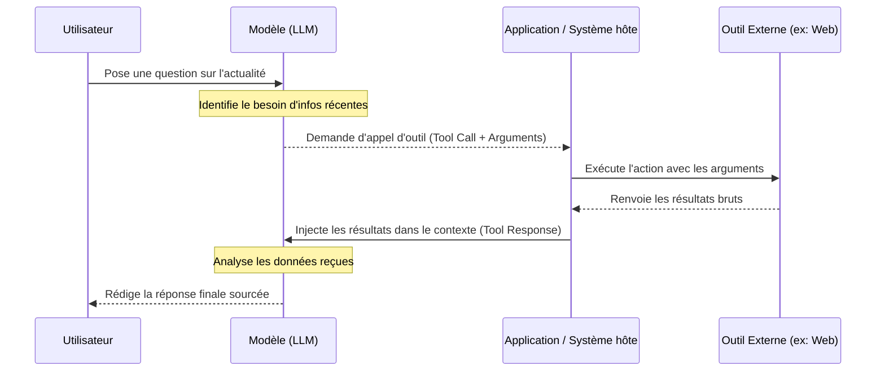

# Qu'est-ce qu'un outil ?

*Claude : fondations → 3. Fonctionnalités, limites et bonnes pratiques → 4. Qu'est-ce qu'un outil ?*

Un outil est une capacité externe qu’un LLM peut appeler pour accomplir une tâche qu’il ne peut pas réaliser uniquement avec ses connaissances internes (ses paramètres figés).

Par défaut, un LLM produit du texte à partir du contexte fourni. Il ne consulte pas spontanément Internet, ne lit pas une base de données d’entreprise, n’envoie pas de courriels, ne crée pas d'événements de calendrier et n’exécute pas de code, sauf si l’application hôte lui donne explicitement accès à ces actions. Un outil sert de pont reliant le modèle à des services ou actions extérieurs.

---

## Le fonctionnement technique d'un outil

Techniquement, l’application fournit au modèle une liste d’outils disponibles lors de sa requête. Chaque outil est décrit précisément par :
- Un **nom** unique (identifiant).
- Une **description** détaillant son rôle.
- Un **schéma de paramètres** (souvent décrit en JSON Schema) spécifiant le type et le format des arguments attendus.

Le modèle analyse le prompt de l'utilisateur. S'il estime qu'un outil est nécessaire, il suspend sa génération textuelle et renvoie à l'application un **appel d'outil** (tool call) contenant les arguments précis. L’application exécute l'outil côté serveur (ex: appel d'une API de météo ou calcul mathématique), récupère le résultat, le réinjecte dans le contexte du modèle, puis le modèle reprend sa génération pour formuler la réponse finale.

---

## Différence fonctionnelle : Sans outil vs Avec outil

| Caractéristique | Sans outil | Avec outil |
|---|---|---|
| **Source de connaissances** | Le modèle répond uniquement d'après sa mémoire interne (données d'entraînement passées). | Le modèle peut interroger des sources externes en temps réel. |
| **Actualisation** | Limité par la date de gel (*knowledge cutoff*). | Récupération d'informations fraîches et à jour. |
| **Capacité d'action** | Produit uniquement une réponse textuelle passive. | Peut déclencher des actions concrètes (envoyer un e-mail, insérer des lignes dans une base). |

---

## L'exemple de la recherche web

La recherche web est l’un des cas d’outils les plus courants. 

### Exemple d'utilisation
- **Question de l'utilisateur** : *"Quelle est la dernière annonce importante d'Anthropic ?"*
- **Analyse du modèle** : Le modèle détecte qu'une information récente (post-cutoff) est indispensable.
- **Appel d'outil** : Il génère une requête structurée pour l'outil de recherche, comme `web_search(query: "dernière annonce Anthropic 2026")`.
- **Exécution** : Le système hôte lance la recherche, récupère les articles de blog récents et les réinjecte en entrée.
- **Réponse finale** : Le modèle synthétise ces informations fraîches de manière structurée et sourcée.

### Le flux d'exécution

---

## Exemples d'outils courants

- **Recherche web** : Consulter des moteurs de recherche pour les faits récents.
- **Base de données** : Récupérer le statut d'une commande client ou des stocks.
- **Calculatrice / Compilateur** : Effectuer des opérations mathématiques ou valider du code de manière déterministe.
- **Outils de communication (E-mail, Slack)** : Rédiger ou envoyer un message.
- **Calendrier** : Créer, modifier ou supprimer des rendez-vous.
- **API métier** : Valider des transactions, générer des factures ou ouvrir des tickets de support.

---

## Point d'attention majeur

Un outil ne rend pas le modèle magiquement infaillible. Le développeur et le modèle doivent encadrer :
- **Quand** l'outil doit être appelé (pour éviter les appels inutiles et coûteux).
- **Quelles données** l'outil peut ingérer (gestion de la sécurité des paramètres).
- **Quelles actions** il est autorisé à exécuter (permissions et contrôles d'accès).
- **Comment le résultat est vérifié** : Le modèle doit analyser de manière critique les retours d'outils, éliminer les sources web peu fiables et savoir dire "je ne sais pas" si les données obtenues restent insuffisantes.
