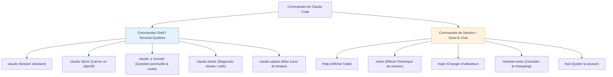

| Indices / questions clés | Notes détaillées |
|---|---|
| Comment installer nativement Claude Code ? | - **macOS/Linux/WSL** : `curl -fsSL https://claude.ai/install.sh | bash` - **Windows PS** : `irm https://claude.ai/install.ps1 | iex` - **Windows CMD** : `curl -fsSL https://claude.ai/install.cmd -o install.cmd && install.cmd` |
| Quelles sont les autres méthodes d'installation ? | - **npm** (globale) : `npm install -g @anthropic-ai/claude-code` (requiert Node.js 18+). - **Homebrew** (macOS) : `brew install --cask claude-code`. - **WinGet** (Windows) : `winget install Anthropic.ClaudeCode`. |
| Différence Shell vs Session ? | - **Commandes Shell** : Lancées depuis le terminal système normal (ex: `claude doctor`). - **Commandes de session** : Lancées dans Claude Code, préfixées par un slash (ex: `/login`). |
| Quelles sont les commandes shell clés ? | - `claude` : session vierge. - `claude "consigne"` : lance une tâche. - `claude -p` : une seule question et quitte (mode passif). - `claude -c` : continuer le chat récent. |
| Quelles sont les commandes de session clés ? | - `/help` : documentation interne. - `/clear` : efface le contexte courant. - `/login` : change de compte d'accès. - `/exit` (ou Ctrl+D) : quitte. |
| Comment maintenir le CLI à jour ? | - Terminal système : `claude update` (mise à jour auto si install native). - Session interactive : `/upgrade` et `/release-notes` (notes de version). |

## Synthèse
L'installation de Claude Code s'effectue idéalement via l'installateur natif (curl/irm) pour bénéficier des mises à jour automatiques. Une fois installé et authentifié dans le navigateur, Claude Code se pilote soit à l'aide de commandes shell en terminal (ex: `claude -p` pour une question ponctuelle) soit par des commandes internes de session (ex: `/clear` pour vider le contexte, ou `/release-notes` pour suivre l'évolution). La commande `claude doctor` est recommandée en cas de dysfonctionnement réseau ou d'accès API.

## Glossaire
- **CLI (Command Line Interface)** : Interface textuelle en ligne de commande permettant à l'utilisateur de piloter des programmes informatiques.
- **Claude doctor** : Commande système de diagnostic effectuant un test de santé de l'installation (connexions, comptes et dépendances).
- **Ghost text (Texte fantôme)** : Suggestion de code semi-transparente affichée dans un terminal ou éditeur, acceptée par pression sur la touche Tab.
- **Installation native** : Installation directe du programme binaire autonome sans dépendre de gestionnaires tiers (npm, Homebrew, Winget).
- **WSL (Windows Subsystem for Linux)** : Outil de Microsoft permettant d'exécuter un environnement Linux complet et natif directement sous Windows.

## Questions d'auto-évaluation
1. Pourquoi est-il déconseillé d'exécuter `sudo npm install -g @anthropic-ai/claude-code` pour l'installation ?
2. Quelle est la différence d'usage concret entre `claude "tâche"` et `claude -p "tâche"` ?
3. Où doit-on taper la commande `/login` pour changer de compte : dans le terminal Linux habituel ou dans le terminal interactif de Claude Code ?

# Installation et présentation du CLI

**Durée : 16 minutes**

## Notes

### Structure des commandes Claude Code

## Points clés

- **L'installation native** est recommandée car elle se met à jour automatiquement, contrairement aux gestionnaires de paquets.
- Ne pas lancer npm en mode administrateur (`sudo`) pour éviter de corrompre les permissions d'exécution.
- **Authentification** : Réalisée via une mire sécurisée de navigateur web au premier lancement, puis enregistrée localement.
- Utilisez `claude doctor` en premier recours pour débugger les problèmes d'intégration réseau.
- Pour une conversation fluide, utilisez `claude -c` afin de reprendre le fil de la session précédente dans ce répertoire.
- Raccourcis de session utiles : **Flèche Haut** (historique des entrées), **Tab** (autocomplétion des commandes `/`), **Shift+Tab** (modes de permissions).
