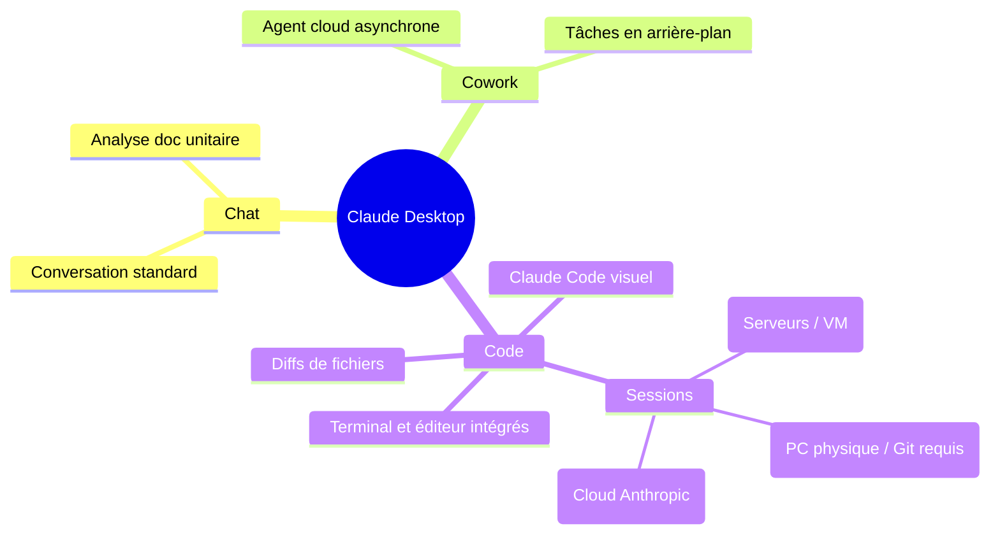

| Indices / questions clés | Notes détaillées |
|---|---|
| Quels sont les 3 onglets principaux ? | - **Chat** : Dialogue standard (comme sur le web). - **Cowork** : Tâches asynchrones autonomes dans le cloud. - **Code** : Interface graphique interactive pour Claude Code. |
| Comment l'obtenir et sur quels OS ? | Disponible officiellement pour macOS (Intel/M1) et Windows (x64/ARM64). **Non disponible sur Linux** (CLI obligatoire sur Linux). |
| Quels sont les 3 modes de session ? | - **Session locale** : Travail sur la machine locale (requiert Git). - **Session distante** : Travail exécuté sur le cloud d'Anthropic. - **SSH** : Manipulation graphique d'un serveur distant. |
| Quel est l'intérêt de la relecture de diffs ? | Permet de visualiser en couleur les ajouts/retraits et de valider ou rejeter individuellement chaque fichier modifié avant application. |
| Pourquoi utiliser plusieurs sessions ? | Permet d'isoler les contextes (ex: 1 session par ticket ou par bug) pour éviter les fuites de contexte et garder des prompts denses et précis. |
| Desktop vs CLI ? | Même intelligence sous-jacente (mêmes configs et MCP). Le CLI est adapté au terminal (scripts/vitesse) ; le Desktop offre le confort visuel. |

## Synthèse
L'application Desktop Claude unifie le chat conversationnel classique, le travail asynchrone (Cowork) et l'intégration graphique de Claude Code (Code). Disponible pour Windows et macOS (mais exclue sous Linux), elle enrichit l'usage développeur grâce à la relecture claire de diffs, la gestion d'onglets multi-sessions et la liaison simple de répertoires locaux ou distants via SSH. Elle repose sur le même moteur que le CLI, mais offre un confort visuel accru.

## Glossaire
- **Claude Cowork** : Fonctionnalité permettant de lancer des agents asynchrones dans l'infrastructure cloud pour des tâches en arrière-plan.
- **Diff graphique** : Outil visuel de comparaison de fichiers affichant les lignes supprimées et ajoutées dans une interface stylisée.
- **Session locale** : Environnement de travail de l'agent opérant sur le système de fichiers physique de l'ordinateur de l'utilisateur.
- **Session distante** : Exécution de l'agent au sein d'une sandbox sécurisée hébergée sur l'infrastructure d'Anthropic.

## Questions d'auto-évaluation
1. Si vous travaillez sur une machine tournant sous Ubuntu, comment devez-vous utiliser Claude Code ?
2. Quelle est la condition indispensable pour que l'onglet Code fonctionne en session locale sur une machine Windows ?
3. En quoi la gestion multi-session de l'application Desktop améliore-t-elle l'efficacité de l'attention (fenêtre de contexte) par rapport à un fil de chat unique ?

# Installation et présentation de l’application Desktop

**Durée : 9 minutes**

## Notes

### Organisation de l'application Desktop Claude

## Points clés

- **Claude Desktop** est réservé aux environnements Windows et macOS ; **Linux** doit s'appuyer sur la version **CLI**.
- L'authentification au compte se fait lors du premier démarrage et requiert un abonnement éligible pour l'onglet **Code**.
- L'onglet **Code** intègre un **éditeur et un terminal** pour observer pas à pas les commandes exécutées par l'agent.
- La **relecture visuelle des diffs** permet une validation ligne par ligne (boutons *Accept / Reject*).
- Divisez vos développements en **onglets multiples** afin d'éviter la pollution de contexte d'une tâche à l'autre.
- Le CLI et l'application Desktop partagent les mêmes fichiers de configurations, skills et MCP.
