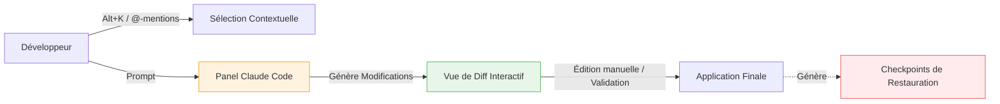

| Indices / questions clés | Notes détaillées |
|---|---|
| Quels sont les prérequis ? | VS Code en version **1.98.0** minimum et un compte compatible (Pro/Team/Enterprise/Console). |
| Comment mentionner du contexte ? | Utiliser les **@-mentions** (ex: `@src/app.ts#5-20` pour cibler une ligne précise) ou le raccourci `Option+K` (macOS) / `Alt+K` (Windows/Linux). |
| Qu'est-ce qu'un checkpoint ? | Point de restauration temporaire en mémoire de session. Il permet d'annuler les modifications de fichiers successives faites par l'agent sans passer par Git. |
| Comment modifier une proposition ? | On peut éditer manuellement le code proposé directement au sein du panneau de diff de comparaison avant de cliquer sur valider. |
| Où sont partagés les paramètres ? | Dans le fichier de configuration global de l'application : `~/.claude/settings.json`. Il unifie les configs de l'extension VS Code et du CLI. |
| Extension vs CLI autonome ? | L'extension est plus visuelle et gère mieux les sélections/diffs. Le CLI reste indispensable pour le terminal intégré et les scripts avancés. |

## Synthèse
L'extension VS Code pour Claude Code offre un environnement graphique intégré qui rapproche l'IA du workflow du développeur. Elle se distingue par l'utilisation de raccourcis de sélection contextuelle (`Alt+K` / `Option+K`), de ciblage précis par @-mentions, et d'une gestion de checkpoints pour annuler des modifications à la volée. Bien qu'elle dispose de sa propre instance d'exécution, elle partage sa configuration avec le CLI autonome via le fichier global `~/.claude/settings.json`.

## Glossaire
- **Alt+K / Option+K** : Raccourci permettant d'insérer instantanément le bloc de code sélectionné en tant que référence contextuelle dans le prompt.
- **Checkpoint** : Point de restauration local créé automatiquement lors des modifications de fichiers par l'agent de code, facilitant les retours en arrière.
- **Developer: Reload Window** : Commande interne de VS Code pour recharger l'éditeur et relancer les extensions bloquées après installation.
- **Diff inline** : Visualisation des modifications proposées intégrée directement au sein de la vue du fichier dans l'éditeur de code.

## Questions d'auto-évaluation
1. Si l'extension VS Code est installée, est-il nécessaire d'avoir installé le CLI autonome pour exécuter `claude` dans le terminal intégré de VS Code ?
2. Quelle est l'utilité d'ajouter des indices de lignes dans une @-mention comme `@index.ts#20-45` ?
3. Comment le fichier `~/.claude/settings.json` permet-il d'unifier l'expérience entre le terminal système et l'éditeur de code ?

# Installation et présentation de l’extension VS Code

**Durée : 7 minutes**

## Notes

### Interactions au sein de l'extension VS Code

## Points clés

- L'extension VS Code requiert **VS Code 1.98.0+** ; elle embarque sa propre copie du CLI de manière transparente.
- Raccourci de sélection contextuelle : **`Option+K`** (macOS) ou **`Alt+K`** (Windows / Linux).
- Les **@-mentions** réduisent la taille du contexte et le coût de l'API en ciblant précisément les fichiers utiles.
- La relecture des modifications s'effectue via un **diff interactif modifiable** par l'utilisateur avant validation.
- Les **checkpoints** sécurisent la session de codage en autorisant des retours en arrière sur les fichiers modifiés.
- Les configurations avancées (MCP, permissions d'exécution) sont centralisées dans le fichier commun `~/.claude/settings.json`.
