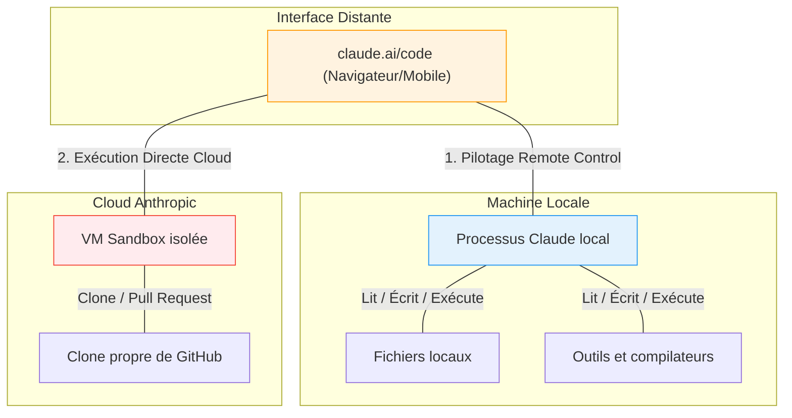

| Indices / questions clés | Notes détaillées |
|---|---|
| Où s'exécute le code ? | - **Local** : Sur votre ordinateur physique (accès outils locaux). - **Remote Control** : Sur votre PC, mais piloté via navigateur/mobile. - **Cloud** : Dans une Sandbox VM d'Anthropic (clone Git/isolé). |
| Qu'est-ce que le Remote Control ? | Expose une session locale active vers l'adresse `claude.ai/code` grâce à la commande `claude remote-control` ou `/remote-control` en session. |
| Comment fonctionne le mode Cloud ? | Connexion à GitHub requise. L'agent travaille dans une VM cloud isolée, modifie le code, lance les tests, puis propose une Pull Request. |
| Qu'est-ce que le mode Plan ? | Lancé via `claude --permission-mode plan`, il ordonne à l'agent de proposer une stratégie de modification sans l'appliquer. |
| À quoi sert --teleport ? | Commande système `claude --teleport` qui récupère une session cloud en cours pour la continuer localement sur votre terminal. |
| Quelle différence sur les fichiers de config ? | - En local : lit `~/.claude/settings.json`. - En cloud : ignore les dossiers utilisateur locaux ; requiert de committer `.claude/settings.json` ou `.mcp.json` dans le dépôt. |

## Synthèse
Les trois modes d'exécution de Claude Code (Local, Remote Control, Cloud) déterminent le lieu de traitement du code et des commandes. L'exécution locale et le *Remote Control* tirent parti de l'écosystème physique de votre machine (fichiers, serveurs MCP locaux), mais requièrent une attention constante. L'exécution Cloud s'appuie sur des machines virtuelles isolées liées à GitHub, idéales pour paralléliser des tâches sans perturber l'espace local. Le passage du Cloud vers le local est géré via la fonction de téléportation (`--teleport`).

## Glossaire
- **--remote** : Option du CLI Claude Code qui délègue l'exécution d'une tâche à l'infrastructure VM cloud d'Anthropic.
- **--teleport** : Commande permettant de rapatrier une branche Git et l'historique d'une session cloud en cours vers son terminal local.
- **Remote Control (rc)** : Mode de pilotage permettant de manipuler visuellement depuis un navigateur ou mobile une instance de calcul restée locale.
- **Setup script** : Script Bash de configuration provisionné dans le dépôt Git pour installer les paquets systèmes nécessaires au build de l'environnement Cloud.

## Questions d'auto-évaluation
1. Si vous lancez `claude remote-control` et fermez ensuite l'écran de votre ordinateur portable, la session à distance sur `claude.ai/code` continue-t-elle de fonctionner ?
2. Quelle est la commande à taper en session pour lier vos outils locaux (gh CLI) à votre compte Cloud ?
3. Pourquoi les serveurs MCP déclarés dans `~/.mcp.json` (dossier utilisateur local) ne fonctionnent-ils pas lors d'une session lancée avec `claude --remote` ?

# Exécution locale, remote et cloud et présentation de claude.ai/code

**Durée : 15 minutes**

## Notes

### Topologie d'exécution de Claude Code

## Points clés

- **--remote** (Exécution Cloud) $\ne$ **Remote Control** (Pilotage d'une session locale via le web).
- En local, l'agent utilise vos bases de données, variables et conteneurs Docker existants.
- **Critère d'arrêt du Remote Control** : La mise en veille ou l'arrêt de votre machine locale interrompt la session distante.
- **L'intégration GitHub** est obligatoire pour exécuter des tâches Cloud classiques.
- **La téléportation** (`claude --teleport <session-id>`) synchronise la branche Git générée par le cloud vers votre espace local.
- **Isolation Cloud** : Parfait pour tester des scripts tiers sans compromettre la sécurité de votre système de fichiers local.
- Toutes les configurations Cloud (serveurs MCP, hooks, skills) doivent être explicitement committées dans le dépôt Git de votre projet.
