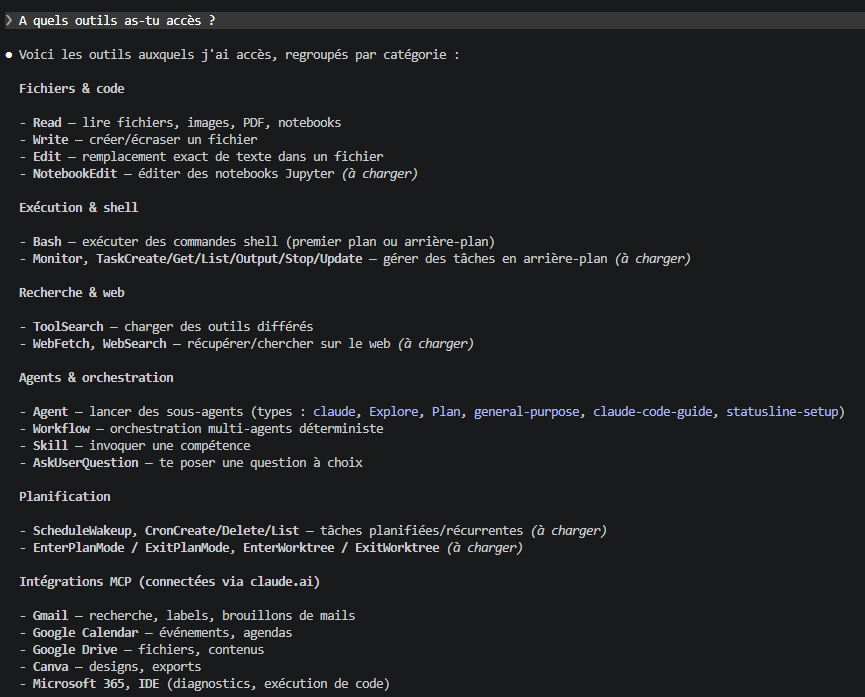

| Indices / questions clés                            | Notes détaillées                                                                                                                                                                    |
| --------------------------------------------------- | ----------------------------------------------------------------------------------------------------------------------------------------------------------------------------------- |
| À quoi servent les outils ?                         | Ils permettent à Claude Code d’interagir avec son environnement : lire et modifier des fichiers, rechercher du code, exécuter des commandes, accéder au web ou déléguer du travail. |
| Le modèle exécute-t-il directement les actions ?    | Non. Le modèle demande l’utilisation d’un outil. Le harness vérifie la demande, applique les permissions puis exécute réellement l’action.                                          |
| Que devient le résultat d’un outil ?                | Il revient dans la session et devient une nouvelle donnée de travail que Claude Code peut utiliser pour décider de la suite.                                                        |
| Quelle différence entre `Read`, `Glob` et `Grep` ?  | `Read` lit un fichier, `Glob` recherche des fichiers par chemin ou nom, et `Grep` recherche du contenu dans les fichiers.                                                           |
| Quelle différence entre `Edit` et `Write` ?         | `Edit` réalise une modification ciblée dans un fichier. `Write` crée ou remplace le contenu complet d’un fichier.                                                                   |
| À quoi sert `Bash` ?                                | À exécuter des commandes shell : tests, builds, scripts, Git, gestionnaires de paquets ou commandes système.                                                                        |
| Quelle différence entre `WebSearch` et `WebFetch` ? | `WebSearch` trouve des pages et leurs URL. `WebFetch` récupère et exploite le contenu d’une URL précise.                                                                            |
| À quoi sert `Agent` ?                               | À créer un subagent possédant sa propre fenêtre de contexte pour lui déléguer une tâche.                                                                                            |
| À quoi sert `Skill` ?                               | À charger une capacité ou une procédure spécialisée qui influence la manière dont Claude Code travaille et utilise ses outils.                                                      |
| Les mêmes outils sont-ils toujours disponibles ?    | Non. Le pool d’outils dépend de la session, de la plateforme, des permissions, des plugins, des serveurs MCP et de la configuration.                                                |
| À quoi servent les permissions ?                    | Elles contrôlent les outils utilisables et peuvent limiter leur usage selon une commande, un chemin, un domaine, une skill ou un type d’agent.                                      |
| Un résultat d’outil est-il toujours complet ?       | Non. Certaines sorties peuvent être limitées, transformées, paginées ou tronquées. Claude Code peut devoir effectuer une nouvelle lecture ou recherche.                             |

## Synthèse

Claude Code utilise des outils pour transformer une intention du modèle en action concrète sur son environnement. Le modèle ne manipule pas directement les fichiers, le shell ou le web : il demande l’utilisation d’un outil, puis exploite son résultat pour poursuivre son travail.

## Glossaire

* outil : interface formelle permettant à Claude Code d’effectuer une opération.
* harness : système qui reçoit les demandes d’outils du modèle, applique les contrôles et réalise l’exécution.
* tool call : demande structurée d’utilisation d’un outil.
* résultat d’outil : information retournée après l’exécution d’un outil.
* pool d’outils : ensemble des outils réellement disponibles dans une session.
* `Read` : outil permettant de lire le contenu d’un fichier.
* `Glob` : outil permettant de rechercher des fichiers à partir de motifs de chemins.
* `Grep` : outil permettant de rechercher du contenu textuel dans des fichiers.
* `LSP` : outil utilisant un serveur de langage pour comprendre les symboles et relations du code.
* `Edit` : outil permettant d’effectuer une modification ciblée dans un fichier.
* `Write` : outil permettant de créer ou remplacer entièrement un fichier.
* `Bash` : outil permettant d’exécuter des commandes shell.
* `WebSearch` : outil permettant d’effectuer une recherche sur le web.
* `WebFetch` : outil permettant de récupérer le contenu d’une URL.
* MCP : protocole permettant d’ajouter des ressources et des outils externes à Claude Code.
* subagent : agent secondaire disposant de son propre contexte et travaillant sur une tâche déléguée.
* skill : capacité spécialisée apportant des instructions ou une procédure à Claude Code.
* hook : mécanisme intervenant dans le cycle de vie d’un outil pour contrôler ou enrichir son exécution.

## Questions d'auto-évaluation

1. Pourquoi dit-on que les outils constituent la surface d’action de Claude Code ?
2. Quelle différence existe-t-il entre une demande d’outil et l’exécution réelle d’une action ?
3. Que devient le résultat retourné par un outil ?
4. Quelle différence existe-t-il entre `Glob` et `Grep` ?
5. Quelle différence existe-t-il entre `Edit` et `Write` ?
6. Dans quel cas utiliser `LSP` plutôt que `Grep` ?
7. Quel est le rôle de `Bash` ?
8. Quelle différence existe-t-il entre `WebSearch` et `WebFetch` ?
9. Que permet l’outil `Agent` ?
10. Quel est le rôle d’une `Skill` ?
11. Pourquoi le pool d’outils peut-il varier d’une session à une autre ?
12. Comment les permissions limitent-elles l’utilisation des outils ?
13. Pourquoi un résultat d’outil ne doit-il pas toujours être considéré comme une représentation complète de l’environnement ?
14. Quelle différence existe-t-il entre un outil MCP et une ressource MCP ?

# Les outils de Claude Code

**Durée : 18 minutes**

## Notes



Les outils constituent la **surface d’action de Claude Code**.

Sans outil, le modèle produit principalement du texte. Grâce aux outils, Claude Code peut interagir avec un environnement de développement.

Il peut notamment :

* lire des fichiers ;
* rechercher dans une base de code ;
* modifier des fichiers ;
* exécuter des commandes ;
* lancer des tests ;
* inspecter des diagnostics ;
* effectuer des recherches web ;
* récupérer des pages web ;
* interagir avec des serveurs MCP ;
* utiliser des skills ;
* déléguer du travail à des subagents.

Un outil est une **interface formelle** possédant un nom, une fonction et des paramètres.

Le modèle n’accède pas directement au disque, au shell ou au réseau.

Le fonctionnement général est :

```text
Claude Code
    ↓
Décide qu'une action est nécessaire
    ↓
Demande l'utilisation d'un outil
    ↓
Harness
    ↓
Vérification des permissions
    ↓
Exécution de l'outil
    ↓
Résultat
    ↓
Claude Code
```

La demande d’outil représente donc une **intention d’action**.

L’action réelle est effectuée par le système qui entoure le modèle.

Le résultat retourné devient ensuite une nouvelle information disponible dans la session.

Par exemple :

```text
Claude Code
    ↓
Read
    ↓
contenu du fichier
    ↓
Claude Code analyse le contenu
    ↓
nouvelle décision
```

Les outils participent ainsi directement à la boucle agentique.

Les outils disponibles peuvent varier selon la session, la plateforme, les permissions, les plugins et les serveurs MCP configurés.

Parmi les principaux outils de lecture et d’exploration :

```text
Read
→ lire un fichier

Glob
→ rechercher des fichiers

Grep
→ rechercher du contenu

LSP
→ comprendre les symboles et relations du code
```

`Read` permet de récupérer le contenu d’un fichier.

`Glob` travaille principalement sur les **chemins et noms de fichiers**.

`Grep` travaille sur le **contenu des fichiers**.

La différence peut être représentée simplement :

```text
Je cherche un fichier
        ↓
      Glob

Je cherche du texte ou du code
        ↓
      Grep
```

`LSP` apporte une compréhension plus sémantique du code.

Contrairement à `Grep`, qui recherche du texte, `LSP` peut travailler avec des notions comme :

* définition ;
* référence ;
* symbole ;
* type ;
* implémentation.

Pour modifier des fichiers, Claude Code dispose notamment de `Edit` et `Write`.

```text
Edit
→ modification ciblée

Write
→ création ou remplacement complet
```

`Edit` est adapté lorsqu’une portion précise d’un fichier doit être modifiée.

`Write` agit sur l’ensemble du contenu du fichier.

Pour exécuter des commandes, Claude Code peut notamment utiliser `Bash`.

Il peut alors :

```text
Bash
├── lancer des tests
├── lancer un build
├── utiliser Git
├── lancer un script
├── utiliser npm / uv / pip
└── exécuter des commandes système
```

Sur les environnements compatibles, `PowerShell` fournit une fonction similaire pour les commandes PowerShell.

Claude Code possède également des outils liés au web.

```text
WebSearch
    ↓
trouver des pages

WebFetch
    ↓
récupérer le contenu d'une page
```

`WebSearch` permet donc principalement de **découvrir des sources**.

`WebFetch` permet ensuite d’**exploiter une source précise**.

Les outils MCP permettent d’étendre les capacités disponibles.

Un serveur MCP peut exposer :

```text
Serveur MCP
├── outils
└── ressources
```

Une ressource MCP représente une donnée pouvant être consultée.

Un outil MCP représente une capacité supplémentaire pouvant être appelée.

Claude Code dispose également d’outils d’orchestration.

L’outil `Agent` permet de créer un **subagent**.

```text
Claude Code
    ↓
Agent
    ↓
Subagent
    ↓
travail spécialisé
    ↓
résultat
    ↓
Claude Code
```

Le subagent possède sa propre fenêtre de contexte et peut travailler sur une tâche spécifique avant de renvoyer son résultat au parent.

`Skill` permet de charger une compétence ou une procédure spécialisée.

Une skill peut apporter :

* des instructions ;
* une méthode ;
* des contraintes ;
* des outils autorisés ;
* une procédure particulière.

On peut simplifier la différence ainsi :

```text
Outil
→ réalise une opération

Skill
→ définit comment accomplir un certain type de travail
```

La liste des outils disponibles n’est pas nécessairement identique dans toutes les sessions.

Le **pool d’outils** est construit à partir de plusieurs éléments :

```text
Outils intégrés
      +
Configuration
      +
Permissions
      +
Plugins
      +
Outils MCP
      ↓
Pool d'outils disponible
```

Le modèle choisit donc uniquement parmi les outils qui lui sont réellement exposés.

Les permissions jouent un rôle important dans ce mécanisme.

Elles peuvent contrôler :

* les commandes exécutables ;
* les fichiers accessibles ;
* les fichiers modifiables ;
* les domaines web accessibles ;
* les skills utilisables ;
* les types de subagents autorisés.

Tous les outils ne présentent pas le même niveau de risque.

Lire un fichier et exécuter une commande système n’ont pas les mêmes conséquences.

Les hooks peuvent également intervenir avant ou après l’utilisation d’un outil.

Ils permettent notamment de :

* bloquer une opération ;
* contrôler une opération ;
* ajouter des informations ;
* réagir à une erreur ;
* intervenir lors d’une demande de permission.

Enfin, un résultat d’outil n’est pas nécessairement complet.

Une sortie peut être :

* tronquée ;
* paginée ;
* transformée ;
* limitée ;
* filtrée.

Claude Code peut donc avoir besoin d’effectuer une nouvelle opération pour obtenir davantage d’informations.

Le fonctionnement général des outils peut finalement être résumé ainsi :

```text
          Modèle
             │
             ↓
        Décision d'agir
             │
             ↓
       Demande d'outil
             │
             ↓
     Permissions / Harness
             │
             ↓
           Outil
             │
             ↓
        Environnement
             │
             ↓
          Résultat
             │
             └──────────→ Modèle
```

Les outils constituent ainsi le lien entre le **raisonnement du modèle** et les **actions réalisées dans l’environnement**.

## Points clés

* Les outils constituent la surface d’action de Claude Code.
* Le modèle ne manipule pas directement le système.
* Claude Code demande l’utilisation d’un outil au harness.
* Le harness contrôle puis exécute réellement l’action.
* Le résultat d’un outil revient dans la session et peut influencer la décision suivante.
* `Read` lit un fichier.
* `Glob` recherche des fichiers.
* `Grep` recherche dans leur contenu.
* `LSP` apporte une compréhension sémantique du code.
* `Edit` réalise des modifications ciblées.
* `Write` crée ou remplace un fichier complet.
* `Bash` permet d’exécuter des commandes.
* `WebSearch` recherche des sources web.
* `WebFetch` récupère le contenu d’une source.
* MCP permet d’ajouter des outils et ressources externes.
* `Agent` permet de déléguer une tâche à un subagent.
* `Skill` apporte une capacité ou une procédure spécialisée.
* Le pool d’outils dépend de la configuration de la session.
* Les permissions limitent les actions autorisées.
* Les hooks peuvent intervenir dans le cycle de vie des outils.
* Une sortie d’outil peut être partielle ou limitée.
* Les outils relient le raisonnement de Claude Code à son environnement.
