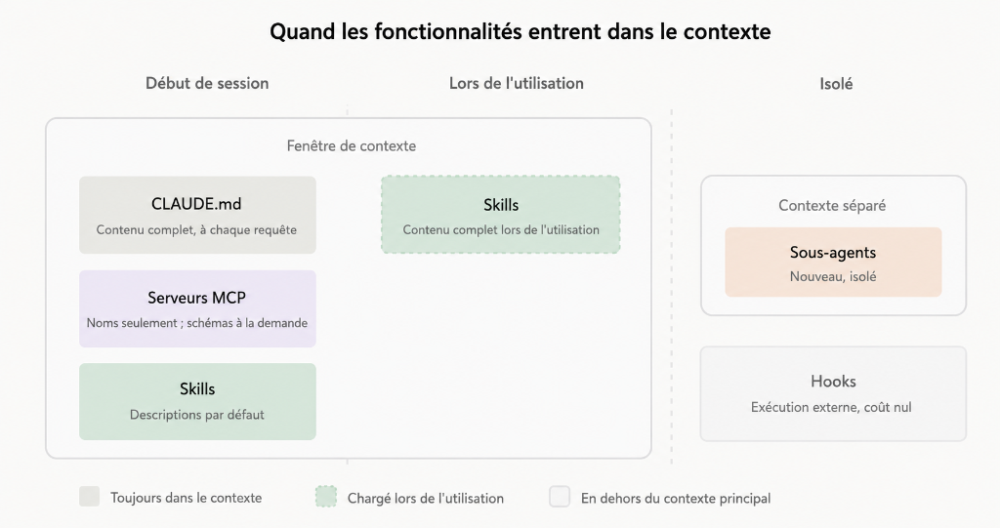

| Indices / questions clés | Notes détaillées |
|---|---|
| Pourquoi étendre Claude Code ? | Pour adapter son fonctionnement lorsqu’une convention doit être connue en permanence, qu’une procédure revient souvent, qu’un système externe doit être utilisé, qu’une tâche doit être isolée ou qu’une action doit être automatique. |
| Une extension remplace-t-elle les outils intégrés ? | Non. Elle spécialise, oriente ou augmente les capacités déjà présentes. |
| Quel mécanisme pour une convention permanente ? | `CLAUDE.md` ou `.claude/rules/`. |
| Quel mécanisme pour une procédure réutilisable ? | Une Skill. |
| Quel mécanisme pour accéder à un système externe ? | MCP. |
| Quel mécanisme pour améliorer la compréhension structurelle du code ? | La code intelligence, généralement à travers un serveur de langage. |
| Quel mécanisme pour isoler une tâche secondaire ? | Un subagent. |
| Quel mécanisme pour coordonner plusieurs agents indépendants ? | Une agent team. |
| Quel mécanisme pour une action déterministe liée à un événement ? | Un hook. |
| Quel mécanisme pour distribuer plusieurs extensions ? | Un plugin. |
| Quelle différence entre `CLAUDE.md` et une Skill ? | `CLAUDE.md` apporte du contexte persistant. Une Skill apporte une procédure ou une expertise chargée lorsqu’elle est utile. |
| Quelle différence entre Skill et MCP ? | Une Skill indique comment travailler. MCP donne accès à des outils, données ou systèmes externes. |
| Quelle différence entre Skill et Hook ? | Une Skill est interprétée par Claude et permet du raisonnement. Un Hook se déclenche automatiquement sur un événement. |
| Pourquoi utiliser un subagent ? | Pour effectuer un travail volumineux ou spécialisé sans saturer le contexte principal. |
| Quand utiliser une agent team ? | Lorsque plusieurs responsabilités ou analyses doivent être menées en parallèle avec coordination entre agents. |
| À quoi sert un plugin ? | À empaqueter, versionner, partager et installer plusieurs capacités sur plusieurs projets ou dans une équipe. |
| Pourquoi ne pas tout activer ? | Chaque extension ajoute potentiellement du contexte, de la complexité, des risques ou des coûts de coordination. |

## Synthèse

Étendre Claude Code consiste à intervenir au bon endroit de sa boucle plutôt qu’à simplement lui ajouter toujours plus de fonctionnalités. Chaque mécanisme répond à un besoin différent : contexte persistant, procédure, accès externe, automatisation, isolation, coordination ou distribution.

## Glossaire

* extension : mécanisme permettant de spécialiser ou d’augmenter le fonctionnement de Claude Code.
* `CLAUDE.md` : fichier donnant à Claude Code des instructions et informations persistantes sur un projet.
* `.claude/rules/` : ensemble de règles pouvant être appliquées à certaines zones ou certains fichiers d’un projet.
* Skill : procédure, expertise ou capacité réutilisable chargée lorsque nécessaire.
* MCP : Model Context Protocol, protocole permettant de connecter Claude Code à des outils, données et services externes.
* code intelligence : capacité utilisant un serveur de langage pour comprendre les symboles, types, références et relations du code.
* subagent : agent secondaire possédant son propre contexte et travaillant sur une tâche déléguée.
* agent team : ensemble de sessions agentiques pouvant travailler et se coordonner en parallèle.
* hook : action déclenchée automatiquement lors d’un événement du cycle de vie de Claude Code.
* plugin : unité installable regroupant plusieurs extensions.
* marketplace : système permettant de découvrir et distribuer des plugins.
* contexte persistant : informations chargées régulièrement afin d’orienter le raisonnement de Claude Code.
* isolation : séparation d’un travail dans un contexte distinct afin de préserver la conversation principale.
* déterministe : comportement devant se produire systématiquement lorsqu’une condition précise est remplie.
* point d’injection : endroit de la boucle agentique où une extension intervient.

## Questions d'auto-évaluation

1. Pourquoi étendre Claude Code alors qu’il possède déjà des outils intégrés ?
2. Quelle différence existe-t-il entre un outil intégré et une extension ?
3. Dans quel cas utiliser `CLAUDE.md` ?
4. Quelle différence existe-t-il entre `CLAUDE.md` et `.claude/rules/` ?
5. Pourquoi ne faut-il pas utiliser `CLAUDE.md` comme mécanisme de sécurité ?
6. Dans quel cas créer une Skill ?
7. Quelle différence existe-t-il entre une Skill de référence et une Skill d’action ?
8. Pourquoi une Skill n’est-elle pas adaptée à toutes les automatisations ?
9. Dans quel cas utiliser MCP ?
10. Quelle différence existe-t-il entre MCP et une Skill ?
11. Quel est l’intérêt de la code intelligence par rapport à Grep ?
12. Pourquoi utiliser un subagent ?
13. Quelle différence existe-t-il entre un subagent et une agent team ?
14. Dans quel cas utiliser un Hook plutôt qu’une Skill ?
15. Pourquoi les Hooks sont-ils adaptés aux comportements déterministes ?
16. Dans quel cas créer un Plugin ?
17. Quelle différence existe-t-il entre une configuration locale `.claude/` et un Plugin ?
18. Pourquoi faut-il être prudent avec les plugins provenant d’une marketplace ?
19. Pourquoi une extension peut-elle augmenter le coût de contexte ?
20. Que signifie l’idée d’« extension minimale efficace » ?

# Étendre les capacités de Claude Code

**Durée : 22 minutes**

## Notes



Claude Code possède déjà des outils intégrés permettant de :
* lire des fichiers ;
* rechercher dans un projet ;
* modifier du code ;
* exécuter des commandes ;
* accéder au web ;
* inspecter du code ;
* déléguer certaines tâches.

Étendre Claude Code ne consiste donc pas simplement à ajouter davantage de commandes.

L’objectif est plutôt de modifier ou spécialiser certains points de son fonctionnement.

Une extension peut agir sur :

```text
Contexte
    ↓
ce que Claude sait

Outils
    ↓
ce que Claude peut appeler

Événements
    ↓
ce qui se déclenche automatiquement

Délégation
    ↓
où le travail est effectué

Distribution
    ↓
comment une capacité est partagée
```

Le choix du mécanisme dépend donc du problème à résoudre.

Une règle simple permet de les distinguer :

```text
Convention permanente
→ CLAUDE.md / .claude/rules/

Procédure réutilisable
→ Skill

Système externe
→ MCP

Compréhension structurelle du code
→ Code intelligence

Travail isolé
→ Subagent

Travail multi-agent
→ Agent team

Action automatique
→ Hook

Distribution
→ Plugin
```

`CLAUDE.md` intervient principalement sur le contexte.

Il permet de fournir à Claude Code des informations persistantes comme :
* les conventions du projet ;
* les commandes de test ;
* les décisions d’architecture ;
* les règles de style ;
* la structure du dépôt ;
* certaines contraintes permanentes.

Par exemple :

```text
CLAUDE.md
    ↓
Convention :
"Les services métier sont dans src/domain/"
    ↓
Claude connaît cette règle
pendant son travail
```

`CLAUDE.md` n’ajoute donc pas un nouvel outil.

Il modifie ce que Claude sait lorsqu’il raisonne.

Son contenu doit rester :
* court ;
* stable ;
* utile ;
* discriminant.

Un fichier trop long consomme du contexte à chaque session et peut introduire du bruit.

Pour les règles spécifiques à certaines zones du projet, `.claude/rules/` est plus adapté.

On peut simplifier ainsi :

```text
CLAUDE.md
→ règles globales

.claude/rules/
→ règles locales
```

Par exemple, un monorepo pourrait contenir différentes règles pour :
* `frontend/`
* `backend/`
* `infrastructure/`

Le point important est également que `CLAUDE.md` guide le modèle, mais ne garantit pas une action.

Une instruction comme :
> Ne jamais modifier le fichier `.env`

reste une instruction interprétée par Claude.

Si cette interdiction doit être garantie, il faut utiliser un mécanisme de contrôle plus fort comme :
* une permission ;
* un hook ;
* une règle externe ;
* un mécanisme de sécurité dédié.

Une Skill intervient lorsque Claude doit disposer d’une procédure ou d’une expertise réutilisable.

Elle peut contenir :
* des instructions ;
* une procédure ;
* une checklist ;
* une expertise métier ;
* des fichiers de support ;
* un workflow.

Une Skill devient pertinente lorsque le même processus revient régulièrement.

Par exemple :

```text
Utilisateur
    ↓
"Effectue l'audit de sécurité habituel"
    ↓
Skill sécurité
    ↓
Procédure d'audit
    ↓
Claude applique la méthode
```

L’intérêt est d’éviter de répéter constamment un long prompt.

Une Skill peut être principalement une Skill de référence.

Elle fournit alors :
* de la documentation ;
* des conventions ;
* des modèles ;
* du vocabulaire ;
* une architecture ;
* des informations métier.

Une Skill peut également être une Skill d’action.

Elle décrit alors une procédure comme :

```text
Préconditions
     ↓
Étapes
     ↓
Utilisation des outils
     ↓
Vérifications
     ↓
Résultat attendu
```

La Skill reste cependant interprétée par Claude.

Elle convient lorsque le travail nécessite :
* du raisonnement ;
* de l’adaptation ;
* du jugement.

Lorsqu’une action doit se produire systématiquement et exactement de la même manière, un Hook est généralement plus adapté.

MCP intervient à un autre niveau.

MCP signifie Model Context Protocol.

Il permet de connecter Claude Code à des systèmes externes.

Par exemple :

```text
Claude Code
     ↓
    MCP
     ↓
┌───────────────┐
│ GitHub        │
│ PostgreSQL    │
│ Monitoring    │
│ Ticketing     │
│ Design        │
│ API interne   │
└───────────────┘
```

Un serveur MCP peut exposer :
* des outils ;
* des ressources ;
* des prompts.

MCP est particulièrement pertinent lorsqu’un utilisateur doit constamment copier des données depuis un système externe vers Claude Code.

Au lieu de faire :

```text
Dashboard
    ↓
copier
    ↓
coller dans Claude
```

on peut avoir :

```text
Claude Code
    ↓
outil MCP
    ↓
Dashboard / API
```

Skill et MCP ne remplissent donc pas la même fonction.

```text
MCP
→ donne accès au système

Skill
→ explique comment l'utiliser correctement
```

Les deux peuvent fonctionner ensemble.

Par exemple, MCP peut fournir un outil permettant d’interroger PostgreSQL.

Une Skill peut alors expliquer :
* quelles tables utiliser ;
* quelles tables éviter ;
* comment anonymiser les données ;
* quelles requêtes sont autorisées ;
* comment présenter le résultat.

MCP augmente cependant la surface de risque.

Un serveur externe peut :
* accéder à des données sensibles ;
* déclencher des actions réelles ;
* provoquer des erreurs ;
* introduire de nouvelles dépendances.

Les serveurs MCP doivent donc être :
* audités ;
* documentés ;
* limités ;
* maintenus ;
* supprimés lorsqu’ils ne sont plus utiles.

La code intelligence étend la compréhension du code.

Une recherche classique avec Grep voit principalement du texte.

La code intelligence utilise un serveur de langage et voit des éléments structurés :

```text
Code intelligence
├── définitions
├── références
├── types
├── diagnostics
├── implémentations
└── relations de code
```

La différence fondamentale peut être résumée ainsi :

```text
Grep
→ voit du texte

Code intelligence
→ comprend des symboles
```

Cette capacité devient particulièrement intéressante dans :
* les grands dépôts ;
* les langages typés ;
* les projets avec beaucoup de symboles similaires ;
* les projets dans lesquels les recherches textuelles produisent trop de bruit.

Elle permet souvent de réduire le nombre de fichiers que Claude doit lire.

Les subagents interviennent au niveau de l’isolation.

Un subagent possède son propre contexte.

Claude Code peut lui déléguer une tâche :

```text
Agent principal
      ↓
   Subagent
      ↓
lit beaucoup de fichiers
analyse
cherche
vérifie
      ↓
résultat synthétique
      ↓
Agent principal
```

Cela évite de remplir le contexte principal avec toutes les étapes intermédiaires.

Un subagent peut être spécialisé.

Il peut par exemple devenir :
* relecteur de sécurité ;
* analyste de tests ;
* explorateur de code ;
* vérificateur SQL ;
* examinateur de documentation.

Il peut disposer de :
* ses propres instructions ;
* ses propres outils ;
* ses propres permissions ;
* son propre modèle ;
* ses propres Skills.

Le point essentiel est la frontière de contexte.

Le subagent permet de réaliser un travail volumineux tout en gardant la conversation principale plus propre.

Il n’est cependant pas nécessaire pour les tâches très courtes.

Pour une petite lecture ou une correction simple, la conversation principale est généralement suffisante.

Les agent teams vont plus loin.

Elles permettent à plusieurs sessions agentiques de travailler sur une même tâche.

Par exemple :

```text
                  Tâche
                    ↓
        ┌───────────┼───────────┐
        ↓           ↓           ↓
    Agent A      Agent B      Agent C
    sécurité     tests      performance
        │           │           │
        └───────────┼───────────┘
                    ↓
               coordination
```

Contrairement à un simple subagent, les membres d’une équipe peuvent avoir des responsabilités distinctes et se coordonner.

Cette approche peut être utile pour :
* analyser plusieurs hypothèses ;
* réaliser une revue multi-angle ;
* répartir plusieurs responsabilités ;
* mener différentes analyses en parallèle.

Elle est cependant plus complexe et plus coûteuse.

```text
Pour une tâche secondaire isolée :
→ Subagent

Pour plusieurs travaux parallèles nécessitant une coordination :
→ Agent team
```

Les Hooks interviennent au niveau des événements.

Un Hook permet de déclencher automatiquement une action lorsque quelque chose se produit.

Par exemple :

```text
Claude modifie un fichier
        ↓
événement
        ↓
Hook
        ↓
lancer le linter
```

Un Hook peut notamment :
* exécuter une commande ;
* appeler une requête HTTP ;
* déclencher une vérification ;
* lancer une invite ;
* créer un subagent ;
* bloquer une opération ;
* produire une notification.

La différence entre Skill et Hook est importante :

```text
Claude doit réfléchir
→ Skill

L'action doit toujours arriver
→ Hook
```

Une Skill laisse une partie de la décision au modèle.

Un Hook associe l’action à un événement précis.

Les Hooks sont donc adaptés aux comportements déterministes comme :
* lancer un formatter ;
* lancer un linter ;
* empêcher la modification d’un fichier ;
* effectuer un audit ;
* vérifier une permission ;
* envoyer une notification.

Un Hook peut également retourner une information à Claude Code.

Par exemple :

```text
Modification
    ↓
Hook
    ↓
Linter
    ↓
"2 erreurs détectées"
    ↓
Claude Code
```

Cette sortie doit cependant rester concise afin de ne pas polluer le contexte.

Les Plugins interviennent principalement au niveau de la distribution.

Un Plugin peut regrouper :

```text
Plugin
├── Skills
├── Agents
├── Hooks
├── serveurs MCP
├── serveurs LSP
└── paramètres
```

Il devient intéressant lorsqu’une configuration doit être :
* partagée ;
* versionnée ;
* réutilisée ;
* installée sur plusieurs projets ;
* maintenue en équipe.

```text
Pour une expérimentation personnelle ou un besoin propre à un projet :
→ .claude/

Pour une capacité destinée à plusieurs projets ou plusieurs utilisateurs :
→ Plugin
```

Le Plugin constitue donc une forme d’industrialisation de la configuration.

Les marketplaces permettent ensuite de distribuer et découvrir ces plugins.

Un Plugin doit néanmoins être considéré comme une dépendance active.

Il peut installer ou activer :
* des Hooks ;
* des agents ;
* des serveurs MCP ;
* des intégrations ;
* des actions capables d’interagir avec l’environnement.

Avant d’installer un Plugin, il faut donc vérifier :
* ce qu’il contient ;
* les permissions demandées ;
* ses dépendances ;
* les actions qu’il déclenche ;
* son mainteneur.

Les extensions peuvent également exister à plusieurs niveaux.

Elles peuvent être :
* utilisateur ;
* projet ;
* locales ;
* organisationnelles ;
* fournies par un Plugin.

Leur comportement de superposition n’est pas nécessairement identique.

Une extension peut donc sembler inactive parce qu’elle est :
* remplacée ;
* masquée ;
* désactivée ;
* non chargée ;
* en conflit avec une autre configuration.

Lorsque la configuration devient complexe, le problème ne doit pas être compensé uniquement par de nouveaux prompts.

Il faut inspecter :
* Portées
* Noms
* Hooks
* Plugins
* Serveurs MCP
* Règles
* Permissions

Chaque extension possède également un coût de contexte différent.

Par exemple :

```text
CLAUDE.md
→ contenu présent régulièrement

Skill
→ contenu détaillé chargé surtout lorsqu'elle est utilisée

MCP
→ descriptions et schémas d'outils

Code intelligence
→ peut réduire les lectures inutiles

Subagent
→ contexte séparé

Hook
→ peu de contexte s'il ne retourne rien
```

Ajouter davantage d’extensions ne rend donc pas automatiquement Claude Code plus performant.

Une configuration trop importante peut :
* augmenter le bruit ;
* consommer du contexte ;
* rendre les comportements difficiles à comprendre ;
* augmenter la surface de risque ;
* compliquer le débogage.

La meilleure stratégie est l’extension minimale efficace.

Il faut ajouter une extension lorsqu’un problème réel apparaît plusieurs fois.

On peut utiliser cette logique :

```text
Claude répète une erreur de convention
→ ajouter une règle

Une règle dépend d'un répertoire
→ utiliser .claude/rules/

Une procédure revient régulièrement
→ créer une Skill

Un service externe est utilisé constamment
→ connecter MCP

Une recherche pollue le contexte principal
→ créer un subagent

Une action doit toujours être exécutée
→ créer un Hook

Une configuration doit être partagée
→ créer un Plugin
```

L’objectif n’est donc pas de rendre Claude Code aussi complexe que possible.

Il faut choisir le mécanisme correspondant précisément au point de la boucle agentique que l’on souhaite modifier.

## Points clés

* Les extensions spécialisent Claude Code sans remplacer ses outils intégrés.
* Il faut choisir une extension selon le point de la boucle que l’on souhaite modifier.
* `CLAUDE.md` fournit du contexte persistant.
* `.claude/rules/` permet de cibler des règles sur certaines zones du projet.
* `CLAUDE.md` guide Claude mais ne constitue pas une barrière de sécurité.
* Une Skill encapsule une procédure ou une expertise réutilisable.
* Une Skill convient lorsqu’une tâche nécessite du raisonnement ou de l’adaptation.
* MCP connecte Claude Code à des outils, données et services externes.
* MCP fournit la capacité d’accès alors qu’une Skill peut fournir la méthode.
* La code intelligence apporte une compréhension structurelle du code au-delà d’une recherche textuelle.
* Un subagent isole une tâche dans un contexte séparé.
* Les subagents permettent de protéger le contexte de la conversation principale.
* Une agent team coordonne plusieurs agents travaillant sur des responsabilités distinctes.
* Un Hook déclenche automatiquement une action lors d’un événement.
* Une Skill est adaptée au raisonnement ; un Hook est adapté aux comportements systématiques.
* Un Plugin regroupe et distribue plusieurs extensions.
* Les Plugins sont utiles pour le partage et la réutilisation multi-projets.
* Les extensions peuvent avoir différentes portées et entrer en conflit.
* Chaque extension possède un coût de contexte et de complexité.
* Ajouter davantage d’extensions n’améliore pas nécessairement Claude Code.
* Il faut privilégier l’extension minimale répondant à un problème réellement observé.
