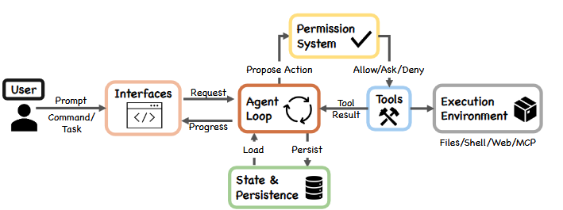
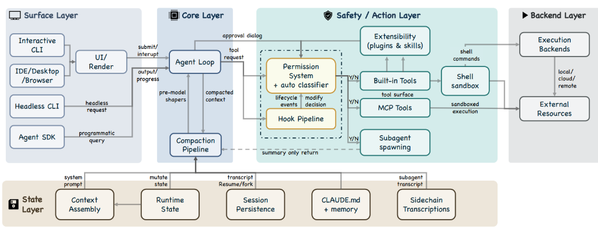

# La boucle agentique de Claude Code

La boucle agentique de Claude Code est le mécanisme d’orchestration qui transforme une demande utilisateur en une trajectoire d’exécution. Elle ne désigne ni une simple réponse du modèle, ni une autonomie générale du système. Elle désigne un cycle contrôlé dans lequel le système prépare un état de décision, appelle le modèle, interprète sa sortie, exécute éventuellement une action effectuée par un outil, récupère une observation, puis réinjecte cette observation dans l’itération suivante.

Cette boucle est dite agentique parce qu’elle introduit une continuité d’action. Le système n’est pas limité à produire immédiatement un texte final. Il peut avancer par étapes, confronter ses hypothèses à l’environnement, recevoir des erreurs, ajuster sa trajectoire, demander de nouvelles opérations et poursuivre jusqu’à atteindre une condition d’arrêt.

Le point décisif est que l’agenticité ne réside pas seulement dans le modèle. Elle résulte de l’articulation entre le modèle, le harness, les outils, les permissions et l’environnement d’exécution. Le modèle produit une décision ou une demande d’action ; le harness transforme cette demande en opération contrôlée ; l’environnement renvoie une observation ; cette observation devient une donnée d’entrée pour la décision suivante.

La boucle agentique doit donc être comprise comme une structure d’orchestration. Elle articule quatre opérations fondamentales : préparer, décider, agir et observer. Ces opérations ne sont pas des étapes pédagogiques séparées ; elles correspondent aux transitions effectives du système pendant l’exécution d’une tâche.

## La position centrale de la boucle

Le schéma place la boucle agentique au centre du trajet fonctionnel. La demande vient de l’utilisateur, passe par une interface, entre dans la boucle, puis peut être transformée en proposition d’action. Cette proposition traverse le système de permissions avant d’atteindre les outils. Les outils interagissent avec l’environnement d’exécution, puis renvoient un résultat. Ce résultat revient dans la boucle et modifie l’état informationnel de l’itération suivante.

### La boucle comme point de convergence

Toutes les surfaces d’entrée alimentent la même logique fondamentale : recevoir une demande, construire un état de travail, appeler le modèle, traiter sa sortie, puis poursuivre ou arrêter. Le terminal interactif, le mode headless, l’intégration IDE ou l’Agent SDK peuvent différer dans leur rendu, leur ergonomie ou leur mode de validation, mais ils convergent vers le même cœur agentique.

La boucle ne remplace pas les composants qui l’entourent. Elle ne tient pas lieu d’interface, de système de permissions, d’outil ou d’environnement. Son rôle est d’organiser le passage entre ces éléments. Elle reçoit une intention, construit un état exploitable par le modèle, interprète la sortie du modèle, route les actions demandées, recueille les observations, puis décide si la trajectoire doit continuer ou s’arrêter.

## De la demande à la trajectoire

Une demande utilisateur ne va pas directement vers une action. Elle entre d’abord dans une structure qui la convertit en état de décision. C’est cette conversion qui donne au système sa continuité. La boucle conserve ce qui a été demandé, ce qui a été tenté, ce qui a échoué, ce qui a été observé et ce qui peut encore être poursuivi.

Cette position explique pourquoi Claude Code ne doit pas être analysé comme une simple interface conversationnelle. Une interface conversationnelle produit une réponse. Une boucle agentique produit une trajectoire : elle maintient une continuité entre intention, décision, autorisation, exécution, observation et réévaluation.

### Le modèle décide, le harness exécute

Le principe architectural central est la séparation entre décision et exécution. Le modèle ne lit pas directement le système de fichiers, ne lance pas directement de commandes shell, ne modifie pas directement le dépôt et n’accède pas directement aux ressources externes. Il produit une sortie. Cette sortie peut être une réponse textuelle, mais elle peut aussi contenir une demande structurée d’utilisation d’outil.

Cette demande structurée n’est pas encore une action. Elle est une proposition d’action exprimée dans un protocole que le harness peut interpréter.

Le harness vérifie que l’outil existe, que ses paramètres sont recevables, que l’outil est exposé dans la session courante, que l’action demandée n’est pas interdite et que les conditions d’autorisation sont satisfaites. L’action ne devient effective qu’après ce passage.

### Intention, autorisation, exécution, observation

La boucle agentique repose sur une distinction stricte entre plusieurs niveaux.
- La décision appartient au modèle : il choisit la prochaine opération pertinente à partir du contexte disponible.
- L’autorisation appartient au système : il vérifie si l’opération demandée peut être exécutée.
- L’exécution appartient à l’outil : il agit sur l’environnement ou interroge une ressource.
- L’observation revient ensuite dans la boucle : elle devient un élément exploitable par le modèle lors de l’itération suivante.

Cette séparation empêche de confondre intention et effet. Une demande d’outil produite par le modèle exprime une intention d’action ; elle ne produit pas encore d’effet dans l’environnement. L’effet apparaît seulement après passage par le harness, les permissions et l’outil. Cette distinction est essentielle : le modèle peut se tromper, mais son erreur ne devient pas automatiquement une modification du système.

### Une délégation contrôlée

La boucle agentique n’est pas une délégation inconditionnelle au modèle. Elle est une boucle de décision médiée. Le modèle propose une trajectoire ; le système encadre cette trajectoire ; l’environnement renvoie un signal ; le modèle réévalue à partir de ce signal.

Cette médiation est ce qui rend l’autonomie exploitable dans un environnement réel. Le modèle peut formuler une action, mais il ne peut pas décider seul d’élargir ses propres droits, d’ignorer une permission ou de contourner une contrainte d’exécution. L’autonomie est donc locale, graduée et encadrée.

## Le tour agentique

L’unité pertinente n’est pas le message utilisateur seul, mais le tour agentique. Un tour commence lorsqu’une nouvelle demande entre dans la boucle. Il se termine lorsque la boucle produit une réponse finale, atteint une condition de vérification suffisante, rencontre un blocage, se suspend ou reçoit une interruption.

Un tour peut contenir une seule itération si le modèle produit directement une réponse finale. Il peut aussi contenir plusieurs itérations si le modèle demande des outils et si les résultats de ces outils appellent de nouvelles décisions.

### Tour et itération

Il faut distinguer le tour et l’itération. Le tour correspond à la trajectoire complète déclenchée par une demande utilisateur. L’itération correspond à un passage interne de la boucle : construction du contexte courant, appel du modèle, traitement de sa sortie, action éventuelle et retour d’observation.

Cette distinction évite de réduire le fonctionnement de Claude Code à un seul échange. Le système peut rester dans le même tour tout en modifiant plusieurs fois sa position informationnelle. Il peut commencer avec une information incomplète, demander une inspection, recevoir un résultat, découvrir une contrainte, ajuster la trajectoire, demander une autre action, puis s’arrêter lorsque la condition de clôture est atteinte.

### La continuité du tour

La continuité du tour est le trait propre de la boucle agentique. Le modèle ne repart pas de zéro à chaque étape. Il reçoit une vue actualisée de l’état du travail, incluant les observations pertinentes produites par les actions précédentes. C’est cette réintégration des résultats qui permet à la boucle d’avancer autrement que par génération isolée.

Une tâche réelle n’est donc pas représentée par une seule réponse, mais par une suite de transitions. Chaque transition peut confirmer la trajectoire, la corriger, l’interrompre ou la réorienter. La boucle maintient cette continuité jusqu’à ce qu’une condition d’arrêt soit atteinte.

## La pipeline interne d’une itération

À l’intérieur d’un tour, chaque itération suit une pipeline relativement stable. Cette pipeline permet de comprendre la boucle comme une procédure d’exécution contrôlée plutôt que comme une conversation improvisée.

### Préparer l’état de décision

La première phase est la résolution des paramètres. Le système détermine les éléments fixes du tour : instructions actives, contexte utilisateur, configuration du modèle, mode d’autorisation, callbacks, signal d’interruption et options de configuration pertinentes. Ces paramètres définissent le cadre dans lequel le modèle sera appelé.

La boucle met ensuite à jour un état mutable. Cet état contient les messages pertinents, les demandes d’outils déjà produites, les résultats reçus, les informations nécessaires à la poursuite du tour et les métadonnées utiles à la récupération. Cet état n’est pas un simple historique textuel. Il constitue le support opérationnel de la boucle.

### Assembler le contexte utile

Vient ensuite l’assemblage du contexte transmis au modèle. La boucle sélectionne ce qui doit être visible pour la décision suivante : la demande utilisateur, les instructions applicables, les observations déjà obtenues, l’état de progression et les éléments nécessaires à la cohérence du tour.

Le contexte intervient ici comme matériau de décision. Il ne s’agit pas d’étudier la gestion du contexte comme sous-système autonome, mais de comprendre son rôle dans la boucle : le modèle ne décide jamais à partir de la totalité abstraite du projet ; il décide à partir de ce que la boucle lui présente à un instant donné.

La boucle ne transmet pas simplement un historique ; elle reconstruit une situation de décision. Cette reconstruction conditionne directement la qualité de l’itération suivante.

### Appeler le modèle et traiter sa sortie

Le modèle est appelé avec le contexte assemblé et avec la surface d’outils disponible. Sa sortie peut prendre deux formes principales : une réponse destinée à l’utilisateur ou une demande d’utilisation d’outil.

Si la sortie ne contient aucune demande d’outil, la boucle peut produire une réponse finale. Si elle contient une demande d’outil, la boucle extrait cette demande, la normalise, l’envoie vers le mécanisme d’autorisation, puis attend le résultat de l’exécution ou du refus.

### Réintégrer le résultat

Lorsque le résultat revient, il est intégré à la conversation opérationnelle. La boucle dispose alors d’un nouvel état. Elle peut rappeler le modèle, poursuivre vers une autre action, se suspendre ou s’arrêter. Le point essentiel est que l’observation produite par l’environnement modifie l’entrée de l’itération suivante.

La pipeline est stable, mais la trajectoire ne l’est pas. L’ordre général des opérations reste contrôlé ; en revanche, les décisions successives dépendent des observations reçues. Une sortie inattendue, une erreur, un refus de permission, un résultat incomplet ou une réussite vérifiable peuvent changer immédiatement la suite du tour.

## La boucle comme cœur d’exécution

Dans cette représentation, la boucle apparaît dans la couche centrale. Elle reçoit les entrées issues des surfaces, s’appuie sur l’état courant, prépare l’appel au modèle, puis route les demandes d’action vers les mécanismes de sécurité et d’exécution. Le schéma montre surtout que la boucle n’est pas un simple appel isolé au modèle. Elle est traversée par des flux : contexte entrant, requête d’outil sortante, décision de permission, résultat d’exécution, mutation d’état et sortie vers l’utilisateur.

### Les couches comme passages, non comme sujets autonomes

La couche de surface reçoit la demande et affiche la progression. La couche cœur contient la boucle agentique. La couche sécurité et action intervient lorsque le modèle demande un outil. La couche état fournit les éléments nécessaires à la continuité du tour. La couche backend correspond à l’environnement où les outils produisent leurs effets.

Dans cette leçon, ces couches ne sont pas étudiées pour elles-mêmes. Elles sont pertinentes uniquement parce qu’elles participent au déroulement de la boucle. La demande descend depuis l’interface vers le cœur. Le cœur appelle le modèle. La sortie du modèle peut remonter vers l’utilisateur ou descendre vers la couche d’action. Si une action est exécutée, le résultat remonte vers la boucle. La boucle décide ensuite si elle doit poursuivre, demander une nouvelle action ou produire une réponse finale.

### Une structure de passage

La boucle agentique est une structure de passage. Elle transforme des entrées textuelles en états de travail, des états de travail en décisions, des décisions en demandes contrôlées, des demandes contrôlées en observations, et des observations en nouvelles décisions.

Cette architecture privilégie un cœur de décision relativement mince et un environnement d’orchestration riche. Le modèle conserve une latitude importante pour choisir la prochaine opération utile, mais cette liberté s’exerce dans un cadre déterminé : outils exposés, permissions actives, contexte disponible, contraintes d’exécution et état de session.

## La demande d’outil dans la boucle

La demande d’outil est le mécanisme par lequel le modèle sort de la simple production textuelle. Elle indique que la prochaine étape ne doit pas être une réponse à l’utilisateur, mais une action intermédiaire contrôlée. Cette action peut viser à obtenir une information, modifier un état ou produire un signal de vérification.

### Une forme intermédiaire entre langage et action

Dans une boucle agentique, une demande d’outil est une forme intermédiaire entre le langage et l’action. Elle n’est ni une phrase ordinaire, ni une exécution directe. Elle exprime une intention opératoire dans un format que le harness peut interpréter.

Cette forme intermédiaire est centrale. Elle permet au modèle de demander une opération tout en laissant au système la responsabilité de l’exécution. Le modèle peut indiquer l’outil voulu et ses paramètres. Le harness vérifie ensuite si cet outil existe, s’il est disponible dans la session, si ses paramètres sont valides, si l’action correspond aux règles d’autorisation et si elle peut être exécutée dans les conditions courantes.

La demande d’outil est donc un acte proposé, non un acte accompli. Elle doit traverser la boucle avant de produire un effet. Ce passage transforme une sortie du modèle en événement système contrôlé.

### Les issues possibles d’une demande d’outil

Une demande d’outil peut être autorisée et exécutée. Elle peut être refusée. Elle peut nécessiter une validation humaine. Elle peut échouer pendant l’exécution. Elle peut produire une sortie trop volumineuse, une observation ambiguë ou un résultat vide. Dans chacun de ces cas, la boucle convertit l’événement en information exploitable pour la suite.

La boucle ne traite pas seulement les succès. Elle traite aussi les refus, les erreurs, les sorties incomplètes, les limites d’exécution et les résultats contradictoires. Cette capacité est essentielle, car un agent de développement réel agit dans un environnement où les hypothèses initiales sont souvent incomplètes.

L’échec n’est donc pas nécessairement une fin. Il peut devenir une observation à forte valeur décisionnelle. Une erreur de test, un diagnostic de compilation, un refus de permission ou une absence de fichier ne sont pas seulement des obstacles ; ce sont des signaux qui peuvent réorienter l’itération suivante.

## L’observation comme moteur de progression

L’observation est le retour produit par l’environnement après une action ou une tentative d’action. Elle peut être un contenu de fichier, une sortie de commande, un diagnostic, une erreur, un résultat de test, un diff, un état Git, un refus de permission ou une information issue d’un service externe.

### Le statut épistémique de l’observation

L’observation n’a pas le même statut qu’une phrase générée par le modèle. Elle provient de l’environnement ou du harness. Elle introduit dans la boucle un signal externe que le modèle ne pouvait pas produire par simple génération. Ce signal permet au système de corriger, préciser, confirmer ou interrompre sa trajectoire.

Sans observation, la boucle reste spéculative. Le modèle peut formuler une hypothèse, proposer une action ou produire une explication. Mais l’agenticité devient effective lorsque le système confronte ces hypothèses à un retour d’environnement. C’est cette confrontation répétée qui distingue une boucle agentique d’une génération isolée.

### Les effets d’une observation sur la suite du tour

Une observation peut confirmer que la trajectoire actuelle est correcte. Elle peut réfuter une hypothèse implicite du modèle. Elle peut révéler une contrainte absente du contexte initial. Elle peut déplacer la tâche vers une sous-opération non prévue. Elle peut bloquer la continuation automatique si une permission ou une erreur critique intervient. Elle peut enfin fournir une condition de clôture si le résultat attendu est atteint.

La qualité de la boucle dépend donc de la qualité des observations. Une observation précise permet une décision suivante plus contrainte. Une observation bruitée, tronquée ou mal interprétée peut orienter la boucle vers une trajectoire inutile.

## La vérification comme observation structurante

La vérification occupe une place particulière dans la boucle, car elle fournit un signal externe sur la qualité de la trajectoire suivie. Une réponse du modèle peut être cohérente sans être correcte. Une vérification issue de l’environnement permet de réduire cette incertitude.

### Vérifier n’est pas conclure

Dans un contexte de développement, la vérification peut prendre la forme d’un test, d’un build, d’un typecheck, d’un linter, d’une inspection de diff ou d’un état de commande. Ce qui importe, du point de vue de la boucle, n’est pas le type exact de vérification, mais le fait que le système obtienne un retour non produit par le modèle lui-même.

Ce retour peut confirmer que la tâche est terminée, indiquer qu’une correction reste nécessaire, révéler une erreur secondaire ou imposer un changement de stratégie. La vérification devient alors une observation à forte valeur décisionnelle.

Une réponse finale n’est pas automatiquement une preuve de réussite. La boucle peut produire une réponse finale parce qu’elle n’a plus d’action à demander, mais la solidité de cette clôture dépend des observations disponibles. Plus la boucle dispose d’un signal externe robuste, plus l’arrêt est justifié.

### La vérification ferme la trajectoire

La vérification n’est pas un supplément ajouté après coup. Elle appartient à la boucle elle-même. Elle donne au système une condition de progression et une condition d’arrêt. Tant que le résultat reste seulement plausible, la boucle demeure fragile. Lorsqu’un signal externe confirme ou invalide la trajectoire, la boucle peut décider de continuer, de corriger ou de s’arrêter sur une base plus solide.

## Les transitions internes de la boucle

Après chaque appel au modèle, la boucle doit déterminer l’état suivant. La sortie peut être une réponse finale, une demande d’outil, une demande impossible à traiter, une sortie interrompue ou une décision qui nécessite une validation. Après chaque outil, la boucle doit également déterminer si le résultat justifie une nouvelle itération, une correction, une suspension ou une clôture.

### Réponse, action, blocage, réorientation

La transition la plus directe est la production d’une réponse finale. Le modèle ne demande pas d’outil supplémentaire et la boucle transmet la réponse à l’utilisateur. Cette issue n’implique pas nécessairement qu’une action ait été exécutée ; elle indique simplement que, pour l’état courant, le modèle considère qu’une réponse textuelle est appropriée.

Une autre transition consiste à poursuivre par action. Le modèle demande un outil, l’action est autorisée, l’outil produit un résultat, et ce résultat est intégré dans l’état du tour. La boucle ne se clôt pas encore ; elle relance le modèle avec une information supplémentaire.

Une autre transition est le blocage. Une permission peut être refusée, un outil peut échouer de manière non récupérable, une contrainte peut empêcher l’exécution ou une validation humaine peut être requise. Dans ce cas, la boucle atteint un état où la continuation automatique n’est plus possible dans les conditions courantes.

Une autre transition est la réorientation. Le résultat d’un outil peut contredire la trajectoire initiale. La boucle continue alors, mais la décision suivante ne poursuit pas nécessairement la même ligne d’action. L’observation modifie le problème tel qu’il est présenté au modèle.

### Maintenir une trajectoire à travers des états hétérogènes

Le caractère agentique vient de la capacité à maintenir une trajectoire à travers des états hétérogènes. La boucle peut passer de la décision à l’action, de l’action à l’observation, de l’observation à une nouvelle décision, puis continuer jusqu’à rencontrer une condition de clôture ou de blocage.

Cette structure n’est pas un while naïf. Elle doit gérer des états de nature différente : sortie du modèle, demande d’outil, permission, effet environnemental, erreur, attente, interruption et réponse finale. La boucle agentique est précisément le mécanisme qui rend ces états compatibles dans une même trajectoire.

## Autorisation et contrôle dans le déroulement de la boucle

Le système de permissions intervient dans la boucle au moment où une demande d’outil doit devenir une opération réelle. Il ne s’agit pas d’un commentaire de sécurité ajouté après la décision du modèle, mais d’une transition obligatoire entre intention et effet.

### La permission comme transition

La boucle distingue ce que le modèle demande et ce que le système autorise. Cette distinction est indispensable dans un agent de développement, car les actions n’ont pas toutes le même niveau de risque. Lire une information, modifier un fichier, exécuter une commande, accéder au réseau ou interagir avec un service externe n’ont pas les mêmes conséquences.

Lorsqu’une demande est refusée, le refus retourne dans la boucle comme information. Le modèle peut alors produire une autre trajectoire compatible avec les contraintes en vigueur, ou expliquer que la tâche ne peut pas être poursuivie sans autorisation supplémentaire.

### Le refus comme observation

Le refus n’est pas seulement un arrêt technique ; il devient un signal de contrôle dans le cycle agentique. Il indique à la boucle qu’une trajectoire n’est pas disponible dans le cadre courant. Ce signal peut réorienter le modèle vers une opération moins risquée, une demande de validation ou une clôture explicite.

La boucle agentique n’est donc pas une délégation inconditionnelle au modèle. C’est une délégation contrôlée, dans laquelle l’action effective dépend d’un passage par le harness. Ce passage rend possible une autonomie graduée sans abandonner l’autorité d’exécution.

## Le rôle de l’utilisateur pendant la boucle

L’utilisateur n’est pas extérieur à la boucle. Il peut fournir du contexte, approuver ou refuser une action, interrompre une trajectoire, limiter le périmètre, imposer une stratégie de vérification ou demander une justification plus explicite avant continuation.

### L’intervention humaine comme contrôle de trajectoire

Cette capacité d’intervention est importante, car la boucle agentique peut partir dans une direction inadéquate si le besoin est ambigu, si le contexte est insuffisant ou si une observation est mal interprétée. L’utilisateur peut alors réorienter la trajectoire sans nécessairement recommencer tout le tour.

L’intervention humaine n’est pas seulement une validation ponctuelle. Elle agit comme un mécanisme de contrôle de trajectoire. Elle peut resserrer le périmètre, préciser l’objectif, augmenter le niveau de preuve attendu ou empêcher une action trop large.

### Autorité humaine et autonomie locale

La boucle agentique combine autonomie locale et autorité humaine. Le modèle peut proposer des actions successives ; le système peut les exécuter lorsqu’elles sont autorisées ; mais l’utilisateur conserve la capacité d’interrompre, de refuser, de corriger ou de redéfinir les conditions de réussite.

Cette organisation est essentielle dans un système de développement. L’agent peut avancer dans le détail opérationnel, mais il ne doit pas substituer sa propre définition du risque, du périmètre ou de la réussite à celle de l’utilisateur.

## Les conditions d’arrêt

Une boucle agentique doit posséder des conditions d’arrêt. Sans cela, le système pourrait continuer à demander des actions, interpréter des résultats et prolonger la trajectoire sans nécessité. L’arrêt n’est donc pas un détail de surface ; il fait partie de la structure même de la boucle.

### Les différentes formes d’arrêt

La boucle peut s’arrêter lorsque le modèle produit une réponse finale sans demande d’outil supplémentaire. Elle peut aussi s’arrêter lorsqu’une observation externe fournit un critère suffisant de réussite. Elle peut se suspendre lorsqu’une validation humaine est nécessaire. Elle peut s’arrêter sur refus si une action requise n’est pas autorisée. Elle peut également s’interrompre en cas d’erreur non récupérable, de limite atteinte ou d’intervention explicite de l’utilisateur.

Ces arrêts n’ont pas tous la même signification. Un arrêt par réussite signifie que la trajectoire a atteint une condition satisfaisante. Un arrêt par refus signifie que la boucle ne peut pas continuer sans franchir une limite d’autorisation. Un arrêt par erreur signifie que l’état courant ne permet plus de produire une action utile. Un arrêt par interruption signifie que la continuité du tour est volontairement coupée.

### La réponse finale comme cas particulier

La réponse finale n’est qu’un cas particulier d’arrêt. Dans une boucle agentique, l’arrêt peut provenir d’une réussite, d’un refus, d’une erreur, d’une suspension, d’une limite atteinte ou d’une intervention humaine.

La boucle agentique n’a donc pas une seule fin possible. Elle peut se clore, se suspendre, échouer, attendre ou transmettre une réponse. Cette pluralité d’issues est nécessaire dans un système qui agit dans un environnement réel plutôt que dans un échange purement conversationnel.

## La différence avec un échange conversationnel

Un échange conversationnel classique suit une structure simple : l’utilisateur écrit, le modèle répond. La boucle agentique introduit une structure différente : l’utilisateur fixe un objectif, le modèle propose une opération, le système contrôle cette opération, l’environnement produit un retour, puis le modèle réévalue la situation.

### La présence d’outils ne suffit pas

La différence ne tient pas seulement à la présence d’outils. Un outil isolé peut fournir une information. Une boucle agentique peut utiliser cette information pour déterminer l’action suivante. L’agenticité vient de la continuité entre décision, action, observation et réorientation.

Cette continuité donne à Claude Code sa forme d’agent de développement. Le système ne se contente pas d’énoncer une solution possible. Il peut engager une procédure, confronter ses décisions à l’état réel du projet, réviser sa trajectoire et poursuivre jusqu’à atteindre une condition d’arrêt.

### De la génération à l’intervention contrôlée

La boucle agentique est le mécanisme qui convertit une capacité de génération en capacité d’intervention contrôlée. Elle ne supprime pas l’incertitude du modèle, mais elle l’inscrit dans un processus où chaque décision peut être médiée, observée et corrigée par le système.

Elle permet à Claude Code de passer d’une réponse à une trajectoire. Cette trajectoire n’est pas une suite arbitraire d’actions. C’est une séquence contrôlée dans laquelle le modèle raisonne, le harness orchestre, les outils exécutent, l’environnement répond et la boucle maintient la continuité entre ces opérations.
