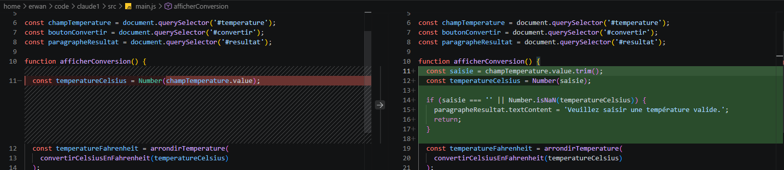

# Première modification de code et boucle de vérification

Dans cette leçon, vous allez demander à Claude Code de réaliser la première modification réelle dans le mini-projet `convertisseur-temperature`. Jusqu'ici, vous avez préparé le projet, vérifié la session, exploré le dépôt en lecture seule et transformé une idée vague en demande précise. Maintenant, vous allez autoriser une modification limitée.

Le changement reste volontairement simple : améliorer le comportement de l'interface quand le champ de température est vide ou invalide. Cette tâche est assez petite pour être comprise en lisant le diff, mais assez concrète pour montrer la boucle complète : demander, modifier, tester, vérifier, résumer et valider.

Le point central de cette leçon est le suivant : une modification générée par Claude n'est pas terminée parce qu'elle semble correcte. Elle est terminée quand vous avez regardé le diff, demandé la preuve, vérifié la preuve, puis validé le résultat.

## Les commandes de cette leçon

Cette leçon introduit trois commandes : `/chrome`, `/copy` et `/export`.

`/chrome` sert à configurer l'intégration avec Claude in Chrome. Dans cette leçon, elle prépare une boucle de vérification frontend : l'idée est de permettre à Claude d'observer une interface, de tester un comportement visible et de ne pas se limiter aux tests automatisés.

`/copy` permet de copier une réponse de Claude, ou un bloc précis, dans le presse-papiers. C'est utile pour récupérer un résumé, une commande, un plan ou une explication courte.

`/export` permet d'exporter la conversation courante en texte. C'est utile pour conserver une trace de la session, partager un résumé avec une équipe ou documenter ce qui a été vérifié.

## Revenir à un état propre

Avant de demander une modification, revenez dans le dossier du projet. Vérifiez l'état du dépôt.

Si le dépôt contient déjà des fichiers modifiés, regardez-les avant de continuer. La première modification avec Claude Code doit partir d'un état connu. Sinon, vous risquez de mélanger vos changements précédents avec ceux produits pendant cette leçon.

Vérifiez aussi que les tests passent avant la modification. Cette étape donne un point de départ. Si les tests échouent déjà avant la modification, il sera impossible de savoir si Claude a cassé quelque chose ou si le projet était déjà dans un état incorrect.

```bash
cd convertisseur-temperature
git status
npm test
```

## Ouvrir Claude Code

Lancez Claude Code depuis la racine du projet.

```bash
claude
```

Si vous avez un doute sur l'environnement, vérifiez rapidement la session :

```text
/status
/doctor
```

Il ne faut pas ignorer cette étape si quelque chose paraît incohérent. Une première modification doit être faite dans une session saine, depuis le bon répertoire, avec un dépôt dont l'état est clair.

## Rappeler le contexte à Claude

Ouvrez une nouvelle conversation.

Avant d'autoriser la modification, demandez à Claude de rappeler le contexte. Cette demande est courte et évite de partir d'une mauvaise interprétation.

```text
Rappelle le contexte de la tâche en cinq lignes maximum.
Indique :
1. le fichier ciblé ;
2. le problème à corriger ;
3. les fichiers à ne pas modifier ;
4. la commande de test à lancer ;
5. la vérification manuelle à prévoir.
```

La réponse attendue doit rester alignée avec la leçon précédente. Le fichier ciblé est `src/main.js`. Le problème concerne le champ de température vide ou invalide. Les fichiers `src/conversion.js` et `index.html` ne doivent pas être modifiés pour cette première correction. La commande de test est `npm test`. La vérification manuelle passe par `npm run dev` et par l'ouverture de la page dans le navigateur.

Si Claude propose déjà de modifier plusieurs fichiers, recadrez immédiatement :

```text
Réduis le périmètre.

Pour cette première modification, tu dois modifier uniquement src/main.js.
Ne modifie pas src/conversion.js.
Ne modifie pas index.html.
Ne crée pas de nouveau fichier.
Ne fais pas de refactorisation opportuniste.
```

## Autoriser la première modification

Vous pouvez maintenant envoyer la demande d'implémentation. Elle doit être précise, limitée et vérifiable.

```text
Pour cette première modification, tu dois modifier uniquement src/main.js.
Ne modifie pas src/conversion.js.
Ne modifie pas index.html.
Ne crée pas de nouveau fichier.
Ne fais pas de refactorisation opportuniste.

Implémente la correction limitée dans src/main.js.

Problème :
si le champ de température est vide ou invalide, l'interface affiche un résultat incorrect.

Objectif :
afficher un message clair au lieu de calculer une conversion incorrecte.

Contraintes :
- modifie uniquement src/main.js ;
- ne modifie pas src/conversion.js ;
- ne modifie pas index.html ;
- ne crée pas de nouveau fichier ;
- n'ajoute aucune dépendance ;
- garde le changement le plus petit possible ;
- conserve le style actuel du code.

Vérification :
- lance npm test ;
- indique comment vérifier manuellement le comportement.

Définition de terminé :
- le message affiché est clair pour une entrée vide ou invalide ;
- les tests existants passent ;
- le diff est résumé ;
- les limites restantes sont indiquées ;
- tu indiques exactement ce qui a été vérifié et ce qui ne l'a pas été.
```

  

## Demander le résultat de la modification

Après la modification, Claude doit terminer avec un résumé utile. Si sa réponse est trop vague, demandez une sortie structurée.

```text
Donne-moi un résumé structuré.
Format attendu :
1. fichiers modifiés ;
2. comportement ajouté ;
3. commande de test exécutée ;
4. résultat du test ;
5. vérification manuelle à faire ;
6. limites restantes.
```

La réponse ne doit pas simplement dire que tout est bon. Elle doit indiquer ce qui a été fait et comment cela a été vérifié. Une affirmation sans commande, sans résultat et sans diff n'est pas une preuve suffisante.

## Regarder le diff

Avant de valider quoi que ce soit, regardez le diff vous-même. C'est le réflexe le plus important de cette leçon.

```bash
git diff
```


Le diff doit être court et limité à `src/main.js`. Si d'autres fichiers ont été modifiés, arrêtez-vous et demandez une explication :

```text
Tu as modifié plus de fichiers que prévu.
Explique pourquoi chaque fichier a été modifié.
Ne fais aucune nouvelle modification.
Je veux d'abord comprendre le diff.
```

Si les modifications ne respectent pas les contraintes, demandez à Claude de revenir à un périmètre plus strict :

```text
Ramène la correction au périmètre demandé.
Conserve uniquement la modification nécessaire dans src/main.js.
Ne modifie pas les autres fichiers.
Garde le comportement attendu :
- message clair si la saisie est vide ;
- message clair si la saisie est invalide ;
- conversion normale si la saisie est valide.
```

Le diff est votre source de vérité. Même si Claude explique bien son travail, c'est le diff qui montre réellement ce qui a changé.

## Lancer les tests automatisés

Si Claude n'a pas lancé les tests, demandez-lui de le faire. Vous pouvez aussi les lancer vous-même dans un terminal.

```bash
npm test
```

Dans ce mini-projet, les tests existants portent sur `src/conversion.js`. Ils ne prouvent pas directement que l'interface affiche le bon message, mais ils prouvent que la logique de conversion existante n'a pas été cassée.

Cette nuance est importante. Un test qui passe ne prouve pas toujours tout. Il prouve seulement ce qu'il couvre. Ici, `npm test` vérifie la logique métier, pas le comportement complet du navigateur.

Demandez à Claude d'expliquer cette limite :

```text
Explique ce que npm test prouve dans ce projet, et ce qu'il ne prouve pas.
Réponds précisément pour cette correction.
```

Une bonne réponse doit dire que les tests automatisés vérifient les fonctions de conversion et d'arrondi, mais qu'ils ne vérifient pas directement l'interaction avec le champ HTML. Pour cela, une vérification manuelle ou une vérification frontend est nécessaire.

## Préparer la vérification frontend

La correction touche l'interface. Il faut donc vérifier le comportement dans un navigateur. Commencez par lancer le serveur local.

```bash
npm run dev
```

Ouvrez ensuite la page locale.

```text
http://localhost:5173
```

Testez trois cas simples :

```text
Cas 1 :
laisser le champ vide, cliquer sur Convertir.
Résultat attendu :
un message demande de saisir une température.

Cas 2 :
saisir une valeur valide comme 20, cliquer sur Convertir.
Résultat attendu :
20 °C correspondent à 68 °F.

Cas 3 :
forcer une valeur invalide si le navigateur le permet.
Résultat attendu :
un message indique que la température est invalide.
```

Le troisième cas dépend du comportement du navigateur avec un champ `type="number"`. Certains navigateurs empêchent ou normalisent certaines saisies invalides. Ce n'est pas un problème. Il faut simplement noter ce qui a réellement été vérifié.

## Utiliser /chrome pour la boucle frontend

Si votre environnement le permet, utilisez `/chrome` pour configurer la vérification avec Claude in Chrome.

```text
/chrome
```

Une fois l'intégration disponible, vous pouvez demander à Claude de vérifier le comportement visible. Par exemple en utilisant Claude Code Desktop :

```text
Vérifie le comportement frontend dans Chrome.

Contexte :
le serveur local tourne avec npm run dev sur http://localhost:5173.

Scénarios à vérifier :
1. champ vide puis clic sur Convertir ;
2. valeur 20 puis clic sur Convertir ;
3. valeur décimale comme 12.5 puis clic sur Convertir.

Pour chaque scénario, indique :
- l'action réalisée ;
- le résultat observé ;
- si le résultat correspond au comportement attendu.

Ne conclus pas que c'est terminé sans observation explicite.
```

`/chrome` ne remplace pas les tests. Il ajoute une vérification par observation de l'interface. Pour une tâche frontend, cette boucle est utile parce que certains problèmes ne se voient pas dans les tests unitaires existants.

Si `/chrome` n'est pas disponible dans votre environnement, gardez la même méthode manuellement. La leçon ne dépend pas de l'outil. Le principe reste le même : quand une modification touche l'interface, il faut observer l'interface.

## Demander la preuve finale

Après les tests et la vérification frontend, demandez une preuve finale. Cette preuve doit séparer les faits vérifiés, les limites et les fichiers modifiés.

```text
Avant que je valide, donne-moi la preuve finale.
Format obligatoire :
1. Fichiers modifiés.
2. Résumé du diff.
3. Commandes exécutées.
4. Résultat exact des commandes.
5. Vérification frontend réalisée.
6. Cas testés dans le navigateur.
7. Ce qui n'a pas été vérifié.
8. Risque restant éventuel.
```

Cette demande est volontairement stricte. Elle empêche une conclusion trop rapide comme "tout fonctionne". Vous voulez savoir ce qui fonctionne, comment cela a été vérifié et ce qui reste hors du périmètre.

## Vérifier le diff une deuxième fois

Après la preuve finale, regardez encore le diff. Cette deuxième lecture est souvent plus claire, car vous connaissez maintenant l'intention du changement.

```bash
git diff
```

À ce stade, vous devez vérifier quatre points :

1. Le diff touche seulement les fichiers autorisés.
2. Le changement correspond au problème demandé.
3. Il n'y a pas de refactorisation inutile.
4. La preuve fournie correspond au changement réalisé.

Si tout est cohérent, la modification peut être gardée. Sinon, demandez à Claude de corriger le périmètre, ou revenez en arrière avec Git.

## Utiliser /copy pour récupérer un résultat court

Une fois la preuve finale obtenue, vous pouvez récupérer la dernière réponse avec `/copy`. Cette commande est utile si vous voulez coller le résumé dans une note, une issue, une pull request ou un message d'équipe.

Vous pouvez aussi demander à Claude de produire un résumé plus compact avant de le copier :

```text
Réduis le résumé final en cinq lignes maximum.
Format :
- changement ;
- fichier modifié ;
- test exécuté ;
- vérification frontend ;
- limite restante.
```

Puis copiez ce résumé.

```text
/copy
```

Le bon réflexe consiste à copier une synthèse utile, pas toute la conversation. Pour un partage court, cinq lignes bien structurées valent mieux qu'un long historique difficile à lire.

## Utiliser /export pour conserver la trace complète

Si vous voulez garder une trace plus complète de la session, utilisez `/export`. Cette commande permet de conserver la conversation sous forme de texte. C'est utile si vous voulez documenter la session, comparer plusieurs essais, archiver une correction ou revenir plus tard sur la manière dont la modification a été décidée.

Vous pouvez aussi demander un résumé avant l'export :

```text
Avant l'export, ajoute un résumé final de session.
Inclue :
1. le problème initial ;
2. la modification réalisée ;
3. les fichiers modifiés ;
4. les commandes exécutées ;
5. la vérification frontend ;
6. les limites restantes ;
7. la décision recommandée : garder, revoir ou annuler.
```

Puis exportez la session.

```text
/export premiere-modification-convertisseur.txt
```

## Décider si la modification est acceptable

La validation finale ne doit pas être automatique. Vous devez décider si le changement est acceptable. Pour cette première modification, la décision se prend sur des critères simples. Si un seul de ces points échoue, ne validez pas encore : demandez une correction limitée ou annulez le changement.

### Annuler si le résultat n'est pas bon

Si le changement ne respecte pas les contraintes, utilisez Git pour revenir à l'état précédent. Pour annuler uniquement les changements non commités dans `src/main.js`, vous pouvez utiliser :

```bash
git checkout -- src/main.js
```

Selon votre version de Git, vous pouvez aussi utiliser :

```bash
git restore src/main.js
```

Ne voyez pas l'annulation comme un échec. C'est l'un des intérêts de travailler avec un dépôt Git propre. Vous pouvez tester une modification, l'évaluer, puis la rejeter si elle ne respecte pas le cadre.

### Garder la modification si elle est correcte

La modification est acceptable si :

1. seul `src/main.js` a été modifié ;
2. le comportement vide ou invalide est plus clair ;
3. la conversion normale fonctionne toujours ;
4. `npm test` passe ;
5. la vérification navigateur est cohérente ;
6. le diff est court et lisible.

Si le diff est correct, les tests passent et la vérification frontend est satisfaisante, vous pouvez garder le changement. Avant de faire un commit, regardez une dernière fois l'état du dépôt.

```bash
git status
git diff
```

Si tout est clair, vous pouvez créer un commit.

```bash
git add src/main.js
git commit -m "Gère les saisies invalides dans le convertisseur"
```

Ce commit n'est pas obligatoire pour comprendre la leçon, mais il est utile pour clôturer proprement l'exercice. Il crée un point de repère avant les prochaines leçons.

## Ce que cette première modification montre

Cette première modification montre que Claude Code est utile quand la tâche est cadrée. Vous n'avez pas demandé "améliore l'application". Vous avez donné un fichier, un problème, des contraintes, une vérification et une définition de terminé.

Le résultat est plus contrôlable. Le diff est court. Les tests sont simples. La vérification frontend est visible. La limite de la preuve est claire : les tests automatisés ne couvrent pas encore le comportement DOM, donc la vérification navigateur reste nécessaire.

Ce modèle s'applique aussi à de vrais projets. Plus le dépôt est grand, plus ce cadrage devient important. Il faut commencer par une modification ciblée, puis élargir seulement si la preuve le justifie.
